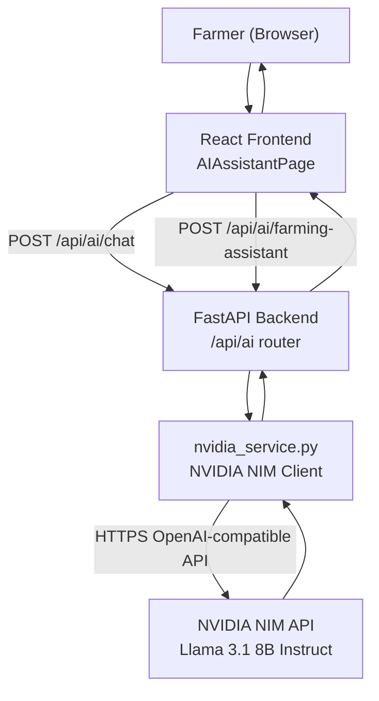
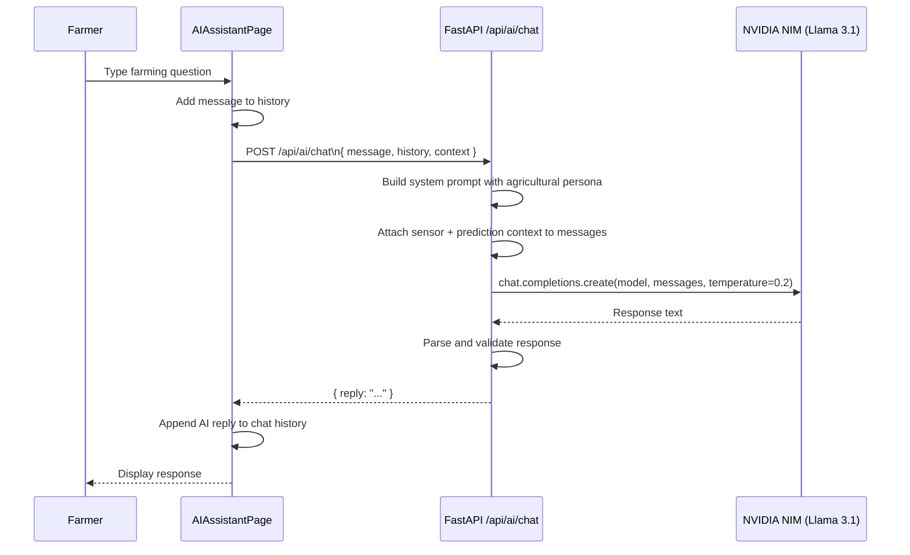

# 💬 AI Chatbot – Agri Shield Farming Assistant

## Overview

The Agri Shield AI Chatbot is a **context-aware agricultural assistant** powered by the **NVIDIA NIM API** using the **Llama 3.1 8B Instruct** large language model. It is integrated into the web platform and provides two modes of interaction:

1. **Farming Advice Mode** – Generates structured treatment advice after a disease is detected.
2. **General Chat Mode** – Answers farming-related questions in a conversational format.

---

## Architecture Overview



---

## NVIDIA NIM Integration

**File:** `backend/app/services/nvidia_service.py`

### API Configuration

| Setting | Value |
|---------|-------|
| Base URL | `https://integrate.api.nvidia.com/v1` |
| Model | `meta/llama-3.1-8b-instruct` |
| API Key | `nvapi-xxxxx` (set in `.env`) |
| Client Library | `openai` Python SDK (v1.0+) |
| Request Timeout | 20 seconds |
| Max Tokens | 1024 per response |
| Temperature | 0.2 (low = more factual, deterministic) |

### Retry Logic
On API failure, the service retries up to **3 times** with backoff before raising an error.

### Mock Mode (Offline Development)
If `NVIDIA_API_KEY` is missing or placeholder:
- `generate_farming_advice()` returns static pre-generated mock advice
- `chat_with_assistant()` returns a canned agricultural message
- No external API calls are made

---

## Mode 1: Farming Advice Generation

Triggered automatically after a disease is detected. The frontend calls this immediately after receiving prediction results.

### Request Schema
```json
{
  "crop_name": "Tomato",
  "disease_name": "Bacterial Spot",
  "confidence": 93.4
}
```

### Prompt Sent to Llama 3.1
```
You are an expert agronomist and farming assistant. Generate highly specific, detailed agronomic advice:
Crop: Tomato
Disease/Condition: Bacterial Spot
AI Detection Confidence: 93.4%

You MUST respond with ONLY a valid JSON object matching the schema below...
{
  "disease_explanation": "...",
  "possible_causes": ["...", "..."],
  "severity": "Low | Medium | High",
  "organic_treatment": "...",
  "chemical_treatment": "...",
  "prevention_methods": ["...", "..."],
  "best_farming_practices": ["...", "..."],
  "farmer_friendly_advice": "..."
}
```

### Response Schema
```json
{
  "disease_explanation": "Bacterial spot is caused by Xanthomonas campestris pv. vesicatoria. It infects leaf tissue through stomata and wounds, causing water-soaked spots that turn brown with yellow halos...",
  "possible_causes": [
    "High humidity (>80%) combined with warm temperatures (25–30°C)",
    "Rain splash or overhead irrigation spreading bacteria",
    "Use of infected transplants or contaminated tools"
  ],
  "severity": "Medium",
  "organic_treatment": "Apply copper-based sprays (copper hydroxide or copper sulfate) at 7-day intervals. Remove and destroy heavily infected plant parts. Apply neem oil spray to reduce spread...",
  "chemical_treatment": "Apply Mancozeb (75% WP) at 2g/L water. Alternate with Streptomycin sulfate (0.02%) for bacterial control. Spray in early morning or evening to avoid leaf burn...",
  "prevention_methods": [
    "Use certified disease-free seeds or transplants",
    "Avoid overhead irrigation; use drip irrigation",
    "Maintain plant spacing for good airflow",
    "Practice crop rotation with non-solanaceous crops"
  ],
  "best_farming_practices": [
    "Apply mulch to prevent rain splash from soil",
    "Sanitize all farm tools with 10% bleach solution",
    "Monitor plants weekly during humid monsoon periods"
  ],
  "farmer_friendly_advice": "Your tomato plants show bacterial spot but it's manageable! Start copper spray treatment today and switch to drip irrigation if possible. Your plants can recover with timely action!"
}
```

---

## Mode 2: General Agricultural Chat

The chatbot maintains conversation history for context-aware multi-turn dialogue.

### Request Schema
```json
{
  "message": "What is the best time to irrigate tomatoes?",
  "history": [
    { "role": "user", "content": "My tomato plants look pale" },
    { "role": "assistant", "content": "Pale tomato leaves often indicate nitrogen deficiency or overwatering. What does the soil look like?" }
  ],
  "context": {
    "recent_prediction": {
      "crop_name": "Tomato",
      "disease_name": "Bacterial Spot",
      "confidence": 93.4
    },
    "sensor_data": {
      "temperature": 28.5,
      "humidity": 64.2,
      "soil_moisture": 42.5
    }
  }
}
```

### Response Schema
```json
{
  "reply": "Based on your current soil moisture of 42.5% and the ongoing bacterial spot infection, I recommend irrigating your tomatoes in the early morning (6–8 AM) using drip irrigation. Avoid evening irrigation as wet foliage overnight promotes bacterial spread. With your current humidity at 64%, the soil should stay moist for 1–2 days after watering..."
}
```

---

## Chatbot Workflow



---

## System Prompt for Chat Mode

The Llama 3.1 model receives a comprehensive system prompt that establishes its persona:

```
You are AgriBot, an expert agricultural assistant for the Agri Shield crop disease detection system. 
You have deep knowledge of:
- Crop diseases and their management (especially for Indian agricultural context)
- Organic and chemical treatment options with dosages
- Soil health, irrigation, and fertilization
- Seasonal farming practices and crop calendars
- Weather impact on crop health

When responding:
1. Always be specific and practical – give actionable advice
2. Mention specific products, dosages, or methods when relevant
3. Consider the Indian farming context (monsoon seasons, common crops)
4. Be encouraging and farmer-friendly in your tone
5. If you have sensor data context, use it to personalize your advice

Current context: {sensor_data} {recent_prediction}
```

---

## Context-Aware Features

The chatbot can receive **context data** along with each message:
- **Sensor data**: Temperature, humidity, soil moisture, light, rain
- **Recent prediction**: Last detected disease, crop name, confidence
- **User profile**: Farm location, preferred language, farming practices

This allows the chatbot to give highly personalized advice:
> "Given your soil moisture reading of 28% (DRY) and the bacterial spot infection on your tomatoes, I strongly recommend..."

---

## Future Enhancements – Voice Assistant

**Phase 2 Plan:**
- Integrate **Web Speech API** (browser) for voice input
- Use **text-to-speech** (TTS) for audio responses
- Support regional language voice input (Hindi, Telugu, Tamil)
- This would allow illiterate farmers to interact with the system using voice commands

---

## Error Handling

| Scenario | Action |
|----------|--------|
| NVIDIA API key missing | Return mock response (no error) |
| API timeout (>20s) | Retry up to 3 times, then raise 502 |
| Invalid JSON from LLM | Parse best-effort, fill missing fields with defaults |
| Rate limit exceeded | Return 502 with "AI service temporarily unavailable" |
| Network error | Return 502 with error details |

---

## Testing the Chatbot Without NVIDIA Key

The system supports a **mock mode** that returns realistic agricultural advice without requiring a live API key. This is automatically activated when `NVIDIA_API_KEY` is empty or contains the placeholder string `"YOUR_NEW_NVIDIA_API_KEY"`.

**Test endpoint:**
```
GET http://localhost:8000/api/ai/test
```
Returns `{ status: "connected" }` if NVIDIA API is properly configured.
