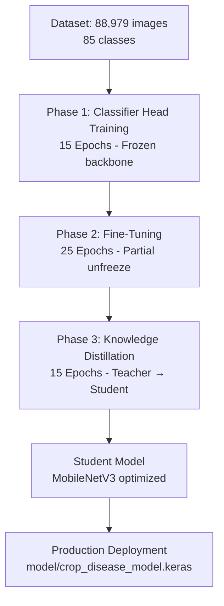
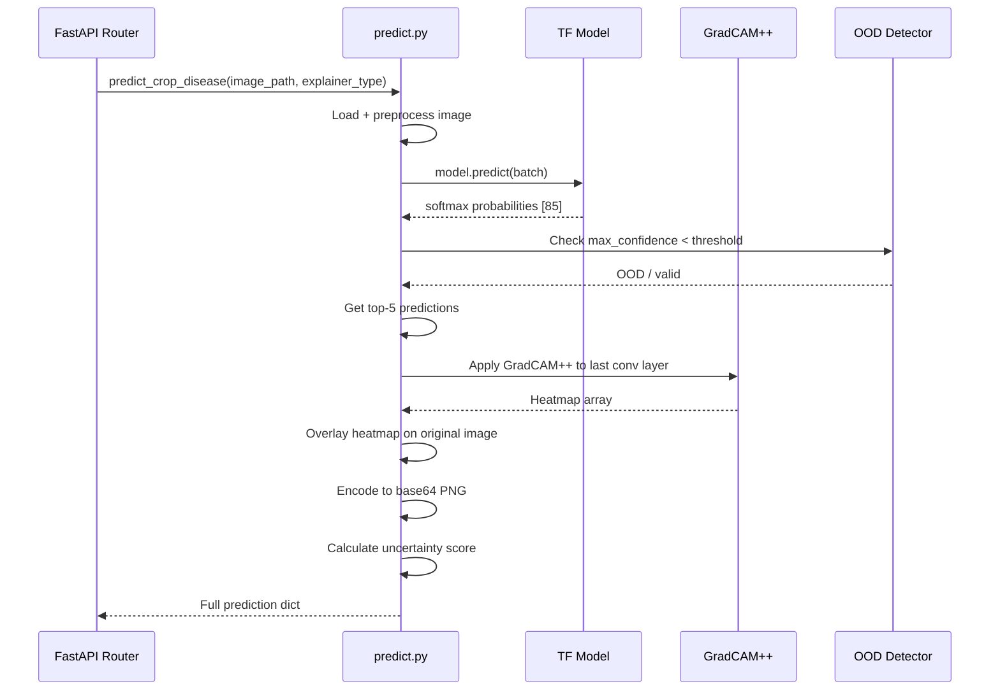

# 🤖 AI Disease Detection – Agri Shield

## Overview

The Agri Shield AI disease detection system is built on a custom-trained **MobileNetV3 deep learning model** trained using a **Knowledge Distillation (KD) pipeline** on the **PlantVillage dataset**. The model can classify **85 different crop disease classes** from a single leaf image in under 2 seconds.

---

## Dataset

### PlantVillage Dataset
| Property | Value |
|----------|-------|
| Source | PlantVillage (Penn State University) |
| Total Images (raw) | ~54,000 (original) |
| After augmentation | **88,979 clean images** |
| Number of Classes | **85 disease/health categories** |
| Crops Covered | Tomato, Potato, Corn, Apple, Grape, Pepper, Strawberry, Peach, Squash, Blueberry, Orange, Raspberry, Soybean, Cherry, Coffee, Rose, Tea (and more) |
| Split | 80% train / 20% validation |
| Image Format | JPG/PNG |
| Image Resolution | Variable (normalized to 224×224 for training) |

### Dataset Preparation
- **File:** `model/prepare_dataset.py`
- Images are scanned from nested class directories.
- Corrupted/truncated images are removed.
- Class names are exported to `model/classes.json` (sorted alphabetically).

---

## Class Label Format

Disease class labels follow the PlantVillage naming convention:
```
<CropName>___<DiseaseName>
Examples:
  Tomato___Bacterial_spot
  Tomato___healthy
  Potato___Early_blight
  Apple___Apple_scab
  Corn_(maize)___Common_rust_
```

The label is parsed at prediction time:
```python
parts = label.split("___")
crop_name = parts[0].replace("_", " ")
disease_name = parts[1].replace("_", " ").title()
```

---

## AI Training Pipeline

The training is a **3-phase progressive pipeline** managed by `model/train.py` and monitored by `model/utils/monitor.py`.

### Training Architecture



---

## Model Architecture

### Teacher Model (Baseline Comparison)
- **Architecture:** EfficientNetV2-B0 (pre-trained on ImageNet)
- **Role:** Provides soft probability targets for Knowledge Distillation
- **Output:** 85-class softmax probability vector

### Student Model (Production)
- **Architecture:** MobileNetV3-Large (with SE Attention Blocks)
- **Input Shape:** (224, 224, 3) – RGB image
- **Output:** 85-class softmax probability vector
- **Advantages:** 4× smaller than teacher, faster inference, suitable for edge/mobile

### Model Architecture Details

```
MobileNetV3-Large (Backbone, pre-trained ImageNet)
├── Input Layer: (None, 224, 224, 3)
├── MobileNetV3 Feature Extractor
│   ├── Inverted Residual Blocks
│   ├── SE (Squeeze-and-Excitation) Attention Modules
│   └── Hard Swish Activation Functions
├── Global Average Pooling
├── Dense Layer: 512 units (ReLU)
├── Dropout: 0.4
├── Dense Layer: 256 units (ReLU)
├── Dropout: 0.3
└── Output Dense: 85 units (Softmax)
```

---

## Training Phases – Detailed

### Phase 1: Classifier Head Training (15 Epochs)

| Property | Value |
|----------|-------|
| Backbone | Frozen (pre-trained weights preserved) |
| Learning Rate | 1e-3 with cosine annealing |
| Optimizer | Adam |
| Loss | Categorical Crossentropy |
| Batch Size | 32 |
| Target | Train classifier head to converge on dataset |
| Best Val Acc | ~54.88% (Epoch 13) |

### Phase 2: Fine-Tuning (25 Epochs – partial)

| Property | Value |
|----------|-------|
| Backbone | Partially unfrozen (last N layers) |
| Learning Rate | 1e-5 (very low to avoid catastrophic forgetting) |
| Optimizer | Adam |
| Loss | Categorical Crossentropy |
| Target | Fine-tune backbone features on crop disease patterns |
| Note | Stopped at Epoch 5 in current run (transitions to KD) |

### Phase 3: Knowledge Distillation (15 Epochs)

Knowledge Distillation transfers knowledge from the **Teacher (EfficientNetV2)** to the **Student (MobileNetV3)** using soft probability targets.

| Property | Value |
|----------|-------|
| Teacher | EfficientNetV2-B0 (baseline, frozen) |
| Student | MobileNetV3-Large |
| Temperature | 4.0 (softens probability distributions) |
| Alpha | 0.7 (balance between KD loss and CE loss) |
| Distillation Loss | KL Divergence (soft targets) |
| Student Loss | Categorical Crossentropy (hard targets) |
| Combined Loss | `alpha × KD_loss + (1-alpha) × CE_loss` |
| Learning Rate | 1e-3 with warmup |
| Current Status | Epoch 7/15 in progress |

**Knowledge Distillation Formula:**
```
L_total = α × T² × KL(σ(teacher/T) || σ(student/T))
        + (1-α) × CE(student, hard_labels)

Where:
  T = temperature (controls softness of probability distribution)
  α = distillation weight
  KL = Kullback-Leibler divergence
```

---

## Training Results (Current)

| Phase | Epochs | Best Val Acc | Status |
|-------|--------|-------------|--------|
| Phase 1 (Head) | 15 | 54.88% | ✅ Completed |
| Phase 2 (Fine-tune) | 5/25 | 54.70% | ✅ Completed |
| Phase 3 (Distillation) | 7/15 ongoing | 43.08% (E6) | 🔄 In Progress |

---

## Image Preprocessing Pipeline

**File:** `model/predict.py` and `model/preprocessing/`

```
Input: Raw image file (JPG/PNG)
  ↓
1. Read image using Pillow (PIL.Image)
2. Convert to RGB (handle RGBA, grayscale)
3. Resize to 224 × 224 pixels (bicubic interpolation)
4. Convert to NumPy array: shape (224, 224, 3)
5. Normalize: pixel values from [0, 255] → [0.0, 1.0]
6. Expand dimensions: (1, 224, 224, 3)  ← batch dimension
7. Feed to model
```

---

## Prediction Inference Flow



---

## GradCAM++ Explainability

**GradCAM++** (Gradient-weighted Class Activation Mapping++) is used to generate visual heatmaps showing which regions of the leaf image the model focused on for its prediction.

**Process:**
1. Forward pass through model
2. Extract gradients of the predicted class score w.r.t. last convolutional layer output
3. Weight the feature maps by global-average-pooled gradients
4. Apply ReLU to discard negative contributions
5. Resize heatmap to 224×224
6. Apply colormap (e.g., JET) for visualization
7. Overlay on original image at 60% opacity

**Output:** Base64-encoded PNG image stored in MongoDB `predictions` collection.

---

## Out-of-Distribution (OOD) Rejection

If the input image is not a crop leaf (e.g., a photo of a car), the model should reject it.

**Implementation:**
- Primary check: If max prediction confidence < `CONFIDENCE_REJECTION_THRESHOLD` (configurable, default ~35%), the prediction is rejected with a `422 Unprocessable Entity` error.
- Secondary: If `raw_label == "OOD"`, an OOD rejection message is returned.

---

## Disease Severity Scoring

Disease severity is estimated from the GradCAM heatmap intensity:

| Heatmap Activation | Severity |
|-------------------|---------|
| < 20% high-intensity pixels | Low |
| 20–50% high-intensity pixels | Medium |
| > 50% high-intensity pixels | High |

---

## Model Files

| File | Purpose |
|------|---------|
| `model/crop_disease_model.keras` | Production model weights (current best) |
| `model/classes.json` | 85 class names in sorted order |
| `model/saved_models/checkpoints/` | Training checkpoints per epoch |
| `model/saved_models/checkpoints/student_model_checkpoint.keras` | Student KD model checkpoint |
| `model/saved_models/checkpoints/student_model_state.json` | Student training state (epoch, loss, acc) |
| `model/saved_models/checkpoints/training_pid.json` | Active training process ID |

---

## Prediction Response Schema

```json
{
  "id": "64abc...",
  "image_path": "uploads/abc123_leaf.jpg",
  "crop_name": "Tomato",
  "disease_name": "Bacterial Spot",
  "confidence": 0.934,
  "prediction_date": "2026-07-16",
  "prediction_time": "18:00:00",
  "prediction_status": "diseased",
  "top_predictions": [
    { "class_name": "Tomato___Bacterial_spot", "crop_name": "Tomato", "disease_name": "Bacterial Spot", "confidence": 0.934 },
    { "class_name": "Tomato___Late_blight", "crop_name": "Tomato", "disease_name": "Late Blight", "confidence": 0.041 }
  ],
  "prediction_time_ms": 1240.5,
  "gradcam_base64": "data:image/png;base64,...",
  "heatmap_base64": "data:image/png;base64,...",
  "comparison_base64": "data:image/png;base64,...",
  "uncertainty_score": 0.066,
  "disease_severity": "Medium",
  "most_affected_region": "Upper leaf surface",
  "possible_causes": ["High humidity", "Rain splash"],
  "similar_diseases": ["Bacterial canker", "Speck"],
  "created_at": "2026-07-16T18:00:00Z"
}
```
