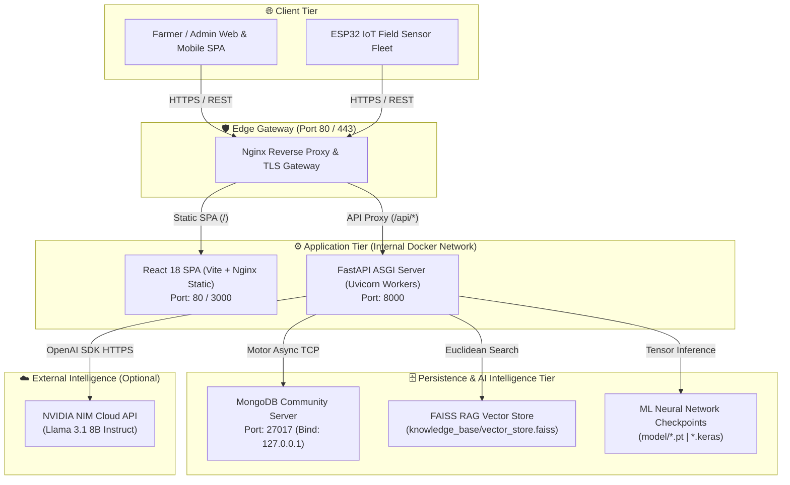

# 🛡️ Administrator Manual – Agri Shield (AI Crop Disease Detection System)

---

## 1. System Architecture Overview

The **AI Crop Disease Detection System (Agri Shield)** is architected as an enterprise-grade, 3-tier full-stack application designed for high-availability agricultural diagnostics and real-time environmental monitoring.



---

## 2. Installation & Server Setup

### 2.1 Prerequisite System Software
* **Operating System:** Ubuntu Linux 22.04 LTS, Debian 11+, or Windows Server / 11 (with WSL2 or Docker).
* **Python Environment:** Python 3.10 or 3.11 with `pip` and `venv`.
* **Node.js Environment:** Node.js v18 LTS or v20 LTS with `npm`.
* **Database:** MongoDB Community Server v6.0+ running locally on port `27017`.

### 2.2 Step-by-Step Installation Commands
1. **Clone Repository & Navigate to Workspace:**
   ```bash
   git clone https://github.com/organization/ai-crop-disease-detection.git
   cd "AI Crop Disease Detection System"
   ```
2. **Provision Backend Python Virtual Environment:**
   ```bash
   python3 -m venv venv
   source venv/bin/activate  # On Windows: venv\Scripts\activate
   pip install --upgrade pip
   pip install -r backend/requirements.txt
   ```
3. **Provision Frontend Node Modules:**
   ```bash
   cd frontend
   npm install
   cd ..
   ```
4. **Verify MongoDB Service Status:**
   ```bash
   # Ensure MongoDB is active and accepting connections on 127.0.0.1:27017
   sudo systemctl status mongod
   ```

---

## 3. Environment Configuration

The backend server loads configuration parameters dynamically from a root `.env` file via `pydantic-settings` (`backend/app/core/config.py`). 

Create a copy of `.env.example` as `.env` and configure mandatory production credentials:

```ini
# Core Environment
ENV=production
HOST=127.0.0.1
PORT=8000
DEBUG=False

# Cryptographic Keys (Must be minimum 32 random hex characters)
JWT_SECRET_KEY=replace_with_secure_64_char_hex_secret_key_2026
REFRESH_TOKEN_SECRET_KEY=replace_with_secure_refresh_64_char_hex_secret_key
JWT_ALGORITHM=HS256

# Database Connection
MONGODB_URI=mongodb://localhost:27017
DATABASE_NAME=crop_disease_db

# IoT Security Enforcements
IOT_API_KEY=replace_with_high_entropy_iot_hardware_key
IOT_SECURITY_MODE=production
ALLOWED_ORIGINS=https://agrishield.farm,https://admin.agrishield.farm

# NVIDIA NIM LLM Integration (Optional - Blank triggers fallback mode)
NVIDIA_API_KEY=nvapi-your-nvidia-api-key-here
NVIDIA_MODEL_NAME=meta/llama-3.1-8b-instruct
```

> [!NOTE]
> For an exhaustive parameter reference and frontend Vite configuration (`VITE_API_URL`), refer to [Overall Project Information/Environment_Configuration.md](file:///c:/AI%20Crop%20Disease%20Detection%20System/Overall%20Project%20Information/Environment_Configuration.md).

---

## 4. MongoDB Administration

The application utilizes asynchronous Motor BSON interactions with MongoDB. The database schema encompasses eight primary collections:

| Collection Name | Document Entity Type | Primary Indexes Enforced |
| :--- | :--- | :--- |
| `users` | User accounts & RBAC roles | Unique Index on `email` |
| `predictions` | AI crop diagnostic scans | Index on `user_id`, `created_at` |
| `farm_profiles` | Farmer location & farm metadata | Unique Index on `user_id` |
| `devices` | Registered ESP32 hardware units | Unique Index on `mac_address`, Index on `owner_id` |
| `iot_telemetry` | Time-series environmental pings | Compound Index on `device_id` + `timestamp` (-1) |
| `kb_articles` | Reference agronomic articles | Text Index on `title` and `content` |
| `revoked_tokens` | Blacklisted JWT identifiers (`jti`) | TTL Index on `expires_at` (Auto-expiring) |
| `weather_cache` | Cached openweather responses | TTL Index on `expires_at` |

### 4.1 Useful Administrative Query Commands (`mongosh`)
* **Check Collection Document Counts:**
  ```javascript
  db.getCollectionNames().forEach(c => print(c + ": " + db[c].countDocuments()));
  ```
* **Find Locked User Accounts:**
  ```javascript
  db.users.find({ failed_login_attempts: { $gte: 5 } }, { email: 1, failed_login_attempts: 1, account_locked_until: 1 });
  ```

---

## 5. User & Role Management (RBAC)

Administrators possess superuser authority governed by `require_role("admin")` in `backend/app/routers/admin.py` and accessible via the frontend **Admin Portal** (`/admin`).

### 5.1 Admin API Management Endpoints
* **List Users (`GET /api/admin/users`):** Retrieves paginated user registries with optional role filtering (`role_filter=farmer|admin|tester`).
* **Create User (`POST /api/admin/create-user`):** Directly provisions new user accounts with predefined roles without requiring public email verification. Enforces enterprise password complexity.
* **Update Role (`PUT /api/admin/users/{id}/role?new_role=...`):** Promotes or demotes accounts across supported RBAC tiers (`admin`, `farmer`, `researcher`, `tester`, `guest`).
* **Edit Details (`PUT /api/admin/users/{id}`):** Modifies user display names, email addresses, language preferences, and farm locations.
* **Force Password Reset (`POST /api/admin/users/{id}/reset-password`):** Overwrites password hashes with a new secure password and immediately resets `failed_login_attempts` to `0` and clears `account_locked_until`.
* **Account Deletion (`DELETE /api/admin/users/{id}`):** Permanently purges user account records from MongoDB.

---

## 6. NVIDIA API Configuration & LLM Routing

AgriBot relies on **NVIDIA NIM (Llama 3.1 8B Instruct)** for intelligent agronomic chat.

### 6.1 Configuration & Fallback Mechanics
* When `NVIDIA_API_KEY` is populated in `.env`, the backend `NvidiaService` establishes HTTPS connections to `NVIDIA_API_BASE_URL`.
* **Degraded Fallback Mode:** If `NVIDIA_API_KEY` is left blank or if cloud network connectivity times out during inference, the backend automatically catches the exception and routes queries to an internal offline rule-based advisory engine. This ensures chatbot endpoints (`/api/ai/chat`) never crash or return `HTTP 500` to farmers.

---

## 7. AI Model Management

The neural network inference engine resides in `model/predict.py` and `backend/app/routers/predict.py`.

### 7.1 Model Readiness Verification
To verify that PyTorch / Keras neural network weights are properly loaded into memory without memory leaks:
```bash
curl -X GET http://127.0.0.1:8000/api/ai/model/status
# Expected JSON Response: {"ready": true, "status": "Model loaded successfully and healthy", ...}
```

### 7.2 Retraining Pipeline Execution
To retrain classification weights using expanded datasets (`model/data/`):
```bash
# Activate virtual environment and launch training script
source venv/bin/activate
python model/train.py --dataset model/data/ --epochs 30 --batch-size 32
```

---

## 8. RAG Knowledge Base Management

The Retrieval-Augmented Generation (RAG) engine (`backend/app/services/kb_manager.py`) enriches AI prompt contexts with agricultural manuals.

### 8.1 Ingesting New Agricultural Manuals
1. Place authoritative `.pdf` manuals directly into `knowledge_base/documents/`.
2. Invoke the synchronization procedure or restart the FastAPI backend server.
3. `KBManager` detects MD5 file hash modifications, splits text into 500-character chunks (with 50-character overlap), generates 384-dimensional vectors using `all-MiniLM-L6-v2`, and overwrites `knowledge_base/vector_store.faiss`, `kb_chunks.json`, and `kb_manifest.json`.

---

## 9. IoT Device Registration & Provisioning

Before field ESP32 nodes can transmit telemetry, their MAC addresses must be registered in MongoDB via `backend/app/routers/devices.py`.

### 9.1 Registering an ESP32 Device
* **Endpoint:** `POST /api/v1/devices/register`
* **Payload Structure:**
  ```json
  {
    "mac_address": "84:CC:A8:12:34:56",
    "name": "North Field Station Alpha",
    "location": "Sector 4 - Tomato Crop",
    "device_type": "ESP32_Solar_Node"
  }
  ```
* Once registered, the device is linked to the authenticated farmer's `owner_id` and authorized to submit telemetry using the shared `X-IoT-API-Key`.

---

## 10. ESP32 Device Management & Monitoring

Administrators monitor hardware fleet health via `backend/app/routers/devices.py` and the Device Management console:
* **Heartbeat Ingestion (`POST /api/v1/devices/heartbeat`):** ESP32 microcontrollers ping the server periodically with battery voltage (`battery`), free SRAM (`heap`), and uptime seconds.
* **Online / Offline Calculation:** Each heartbeat updates the `last_seen` UTC timestamp in MongoDB. When querying device lists (`GET /api/v1/devices`), the server dynamically computes operational status: nodes failing to check in within the configured threshold are marked as `status: "offline"`.

---

## 11. Telemetry Monitoring & Rate Limiting Defense

High-frequency sensor data is ingested via `POST /api/v1/iot/telemetry` (`backend/app/routers/iot.py`) and governed by multi-layered security gates:
1. **Physical Bounds Sanitization:** `validate_sensor_payload()` in `iot_security.py` checks incoming metrics against physical boundaries (e.g., Temperature `-10°C to 65°C`, Volumetric Moisture `0% to 100%`). Impossible values (such as `500°C`) are rejected (`HTTP 400 Bad Request`).
2. **Sliding-Window Rate Limiting:** Implemented in `rate_limiter.py`, telemetry ingestion is capped at **60 requests per minute per MAC ID** (`IOT_LIMIT`). Excess traffic bursts receive `HTTP 429 Too Many Requests`, preventing database flooding.

---

## 12. Security Audit Logging & Observability

Implemented in `backend/app/core/audit_logger.py`, all security-sensitive operations are captured in structured JSON logs written to `backend/logs/security_audit.log`.

### 12.1 Audited Event Types & PII Masking
* **Tracked Events:** `LOGIN_SUCCESS`, `LOGIN_FAILED`, `ACCOUNT_LOCKED`, `PREDICTION_REQUEST`, `AI_PROMPT_BLOCKED`, `FILE_UPLOAD_BLOCKED`, `RATE_LIMIT_EXCEEDED`, and `IOT_DATA_RECEIVED`.
* **Automated PII Redaction:** Before writing to disk, `mask_sensitive_data()` automatically redacts dictionary values matching `password`, `password_hash`, `access_token`, `refresh_token`, `jwt`, `api_key`, `secret`, or `token` with `"***REDACTED***"`.

---

## 13. JWT Authentication & Lockout Management

Identity security is enforced via `backend/app/core/security.py`:
* **Token Expiration SLAs:** Access tokens expire after **120 minutes** (`ACCESS_TOKEN_EXPIRE_MINUTES`); refresh tokens expire after **7 days** (`REFRESH_TOKEN_EXPIRE_DAYS`).
* **Revocation List:** Logout requests (`POST /api/auth/logout`) extract the JWT unique ID (`jti`) and append it to MongoDB's `revoked_tokens` collection (backed by an in-memory fallback cache `REVOKED_TOKENS` for offline resilience).
* **Account Lockout Policy:** If a user accumulates **5 consecutive failed login attempts** (`MAX_LOGIN_ATTEMPTS`), their account is automatically locked for **15 minutes** (`LOCKOUT_DURATION_MINUTES`). Administrators can manually override and clear this lockout via `POST /api/admin/users/{id}/reset-password`.

---

## 14. Database Backup Procedures

To perform zero-downtime snapshots of all MongoDB collections (`users`, `predictions`, `devices`, `iot_telemetry`, etc.):
```bash
# Execute local database dump to timestamped backup directory
mongodump --uri="mongodb://localhost:27017" --db=crop_disease_db --out=/var/backups/agrishield/db/$(date +%F)
```
> [!NOTE]
> For detailed retention policies and local archive commands (`tar -czvf`) covering `uploads/`, `model/`, and `knowledge_base/`, refer to [Overall Project Information/Backup_and_Recovery_Strategy.md](file:///c:/AI%20Crop%20Disease%20Detection%20System/Overall%20Project%20Information/Backup_and_Recovery_Strategy.md).

---

## 15. Database Recovery Procedures

To restore MongoDB collections from a verified binary BSON archive following a volume failure:
```bash
# Drop existing corrupted collections and restore from BSON dump
mongorestore --uri="mongodb://localhost:27017" --db=crop_disease_db --drop /var/backups/agrishield/db/2026-07-26/crop_disease_db
```

---

## 16. System Updates & Service Restart

To apply application code updates from version control without altering database persistence:
```bash
# Pull latest production release
git pull origin main

# Restart Uvicorn FastAPI backend service (Linux systemd example)
sudo systemctl restart agrishield-backend

# Restart Nginx reverse proxy gateway
sudo systemctl reload nginx
```

---

## 17. Software Dependency Auditing & Patching

To scan and remediate Common Vulnerabilities and Exposures (CVEs) across third-party libraries:
1. **Python Backend Audit:**
   ```bash
   source venv/bin/activate
   pip install pip-audit
   pip-audit -r backend/requirements.txt
   ```
2. **Node.js Frontend Audit:**
   ```bash
   cd frontend
   npm audit fix
   ```

---

## 18. Troubleshooting Guide

### Issue: Uvicorn server fails to start with "Address already in use (Port 8000)".
* **Diagnosis:** A orphaned Python process is holding TCP port 8000 open.
* **Resolution:** Find and kill the conflicting PID:
  ```bash
  lsof -i :8000
  kill -9 <PID>
  ```

### Issue: MongoDB connection refused on startup (`ServerSelectionTimeoutError`).
* **Diagnosis:** MongoDB Community Server is down or bound to a different interface than specified in `MONGODB_URI`.
* **Resolution:** Verify systemd service status and inspect `/etc/mongod.conf` binding IP:
  ```bash
  sudo systemctl start mongod
  sudo netstat -plnt | grep 27017
  ```

### Issue: Image upload fails with HTTP 400 "Dangerous double extension detected".
* **Diagnosis:** A user attempted to upload a file named like `image.php.jpg` or `scan.exe.png`.
* **Resolution:** This is an expected security interception by `upload_validator.py`. No server action required; check `security_audit.log` for originating client IP.

---

## 19. Disaster Recovery (DR) Summary

The system is engineered for a Recovery Time Objective (RTO) of under 30 minutes following total hardware failure. The 3-phase restoration sequence requires:
1. Provisioning clean OS host, Docker runtime, and MongoDB server.
2. Restoring database collections via `mongorestore`.
3. Extracting local filesystem archive (`tar -xzvf`) containing `uploads/`, `model/`, and `knowledge_base/`.
4. Verifying service restoration via `GET /api/v1/health`.
> [!IMPORTANT]
> Consult the complete DR flowchart in [Overall Project Information/Backup_and_Recovery_Strategy.md](file:///c:/AI%20Crop%20Disease%20Detection%20System/Overall%20Project%20Information/Backup_and_Recovery_Strategy.md).

---

## 20. Maintenance Schedule Summary

| Component | Task Description | Frequency | Target Module |
| :--- | :--- | :---: | :--- |
| **RAG Knowledge Base** | Ingest new PDFs and rebuild FAISS vector index. | Monthly | `kb_manager.py` |
| **MongoDB Database** | Defragment storage and execute collection compaction. | Semi-Annually | `mongosh` compact command |
| **AI ML Models** | Retrain neural network weights on new seasonal images. | Annually | `model/train.py` |
| **Dependencies** | Audit Python and Node.js package vulnerabilities. | Monthly | `pip-audit` / `npm audit` |
| **IoT Hardware** | Clean physical electrodes, domes, and inspect battery voltage.| Quarterly | ESP32 field hardware |
> [!NOTE]
> For step-by-step maintenance commands and physical sensor cleaning instructions, see [Overall Project Information/Maintenance_Guide.md](file:///c:/AI%20Crop%20Disease%20Detection%20System/Overall%20Project%20Information/Maintenance_Guide.md).

---

## 21. Appendix & Quick Reference Cheatsheet

### 21.1 Quick Administrative Command Cheatsheet
| Operation | Command Line Syntax |
| :--- | :--- |
| **Check Backend Health** | `curl -X GET http://127.0.0.1:8000/api/v1/health` |
| **Check AI Model Status** | `curl -X GET http://127.0.0.1:8000/api/ai/model/status` |
| **Tail Security Audit Log**| `tail -f backend/logs/security_audit.log` |
| **Execute MongoDB Dump** | `mongodump --uri="mongodb://localhost:27017" --db=crop_disease_db --out=/backups/$(date +%F)` |
| **Run ML Retraining** | `python model/train.py --dataset model/data/ --epochs 30 --batch-size 32` |

### 21.2 Repository Directory Structure Reference
```text
AI Crop Disease Detection System/
├── backend/                  # FastAPI ASGI Backend & Services
│   ├── app/
│   │   ├── core/             # config.py, security.py, rate_limiter.py, audit_logger.py
│   │   ├── db/               # mongodb.py (Motor async driver)
│   │   ├── models/           # Pydantic V2 schemas & database models
│   │   ├── routers/          # auth, predict, ai, iot, devices, admin, analytics
│   │   └── services/         # kb_manager.py, nvidia_service.py, websocket_manager.py
│   ├── logs/                 # security_audit.log destination
│   └── requirements.txt      # Python backend dependencies
├── frontend/                 # React 18 SPA (Vite + Nginx)
│   ├── src/
│   │   ├── components/       # UI widgets, dashboard panels, intelligence cards
│   │   ├── pages/            # AdminPage, DashboardPage, LoginPage, DevicesPage
│   │   └── services/         # api.js (Axios client with VITE_API_URL)
│   └── package.json          # Node.js frontend dependencies
├── knowledge_base/           # RAG Architecture Storage
│   ├── documents/            # Ingested agricultural PDF manuals
│   ├── vector_store.faiss    # Compiled binary Euclidean FAISS index
│   ├── kb_chunks.json        # Serialized text chunk registry
│   └── kb_manifest.json      # Document MD5 hash & version tracking
├── model/                    # ML Neural Network Classification Pipeline
│   ├── predict.py            # Inference engine & health diagnostics
│   ├── train.py              # Automated retraining script
│   └── *.pt / *.keras        # Trained PyTorch / Keras model checkpoints
├── uploads/                  # Buffered diagnostic crop leaf images buffer
└── Overall Project Information/ # Comprehensive System & Architecture Documentation
```
