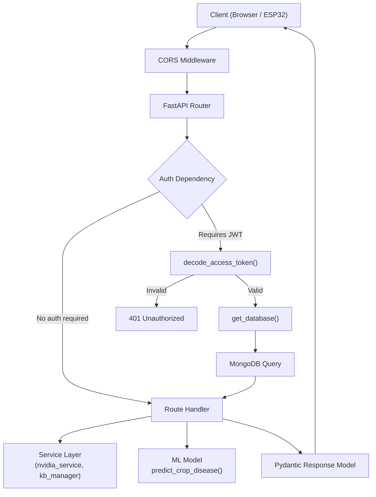

# ⚙️ Backend Architecture – Agri Shield FastAPI

## Overview

The backend is a **FastAPI** application served by **Uvicorn** ASGI server. It provides REST API endpoints for user authentication, image upload, AI disease prediction, chatbot integration, and IoT telemetry ingestion.

---

## Backend Folder Structure

```
backend/
├── app/
│   ├── main.py                 # FastAPI app factory + router registration
│   ├── core/
│   │   ├── config.py           # Settings (env var loading via pydantic-settings)
│   │   └── security.py         # JWT creation/decode, bcrypt, OAuth2 scheme
│   ├── db/
│   │   └── mongodb.py          # Motor async MongoDB client + connection lifecycle
│   ├── models/
│   │   └── schemas.py          # All Pydantic request/response models
│   ├── routers/
│   │   ├── auth.py             # /api/auth (register, login, profile)
│   │   ├── predict.py          # /api/upload, /api/predict, /api/history
│   │   ├── ai.py               # /api/ai (farming-assistant, chat)
│   │   ├── iot.py              # /api/v1/iot (telemetry, heartbeat)
│   │   └── devices.py          # /api/v1/devices (register, config, ota, status)
│   ├── services/
│   │   ├── nvidia_service.py   # NVIDIA NIM LLM API client
│   │   ├── kb_manager.py       # Agricultural knowledge base manager
│   │   └── recommendation_engine.py  # Crop recommendation logic
│   └── knowledge_base/         # Static agricultural knowledge JSON files
├── tests/                      # pytest test suites
├── requirements.txt            # Python dependencies
└── .env                        # Active environment configuration
```

---

## FastAPI Application Startup

**File:** `backend/app/main.py`

The application uses **lifespan context manager** for startup/shutdown events:

```
Startup:
  1. Connect to MongoDB (Motor)
  2. Initialize and validate TF model (MobileNetV3)
  3. Create uploads/ directory if not exists

Shutdown:
  1. Close MongoDB connection
```

**Router registration order:**
1. `auth.router` → `/api/auth/*`
2. `predict.router` → `/api/upload`, `/api/predict`, `/api/history`
3. `ai.router` → `/api/ai/*`
4. `iot.router` → `/api/v1/iot/*`
5. `devices.router` → `/api/v1/devices/*`
6. Dynamic `v1_router` → `/api/v1/*` (mirrors legacy routes)

---

## Security Architecture

**File:** `backend/app/core/security.py`

| Component | Implementation |
|-----------|---------------|
| Password Hashing | bcrypt via passlib |
| JWT Tokens | python-jose (HS256) |
| Token Expiry | 1440 minutes (24 hours, configurable) |
| OAuth2 Scheme | `OAuth2PasswordBearer` with `/api/auth/login` token URL |
| CORS | Allow all origins in `development`, restricted in `production` |

**JWT Payload:**
```json
{
  "sub": "<mongodb_user_id>",
  "exp": <unix_timestamp>
}
```

---

## MongoDB Collections

### `users`
```json
{
  "_id": ObjectId,
  "name": "Farmer Name",
  "email": "farmer@example.com",
  "password_hash": "$2b$12$...",
  "role": "farmer",
  "farm_location": "Hyderabad, Telangana",
  "preferred_language": "te",
  "farming_practices": "Conventional",
  "crop_history": [],
  "created_at": ISODate
}
```

### `predictions`
```json
{
  "_id": ObjectId,
  "user_id": "64abc123...",
  "image_path": "uploads/abc123_leaf.jpg",
  "crop_name": "Tomato",
  "disease_name": "Tomato___Bacterial_spot",
  "confidence": 0.934,
  "prediction_date": "2026-07-16",
  "prediction_time": "18:00:00",
  "prediction_status": "diseased",
  "top_predictions": [...],
  "prediction_time_ms": 1240.5,
  "gradcam_base64": "data:image/png;base64,...",
  "uncertainty_score": 0.066,
  "disease_severity": "Medium",
  "most_affected_region": "Upper leaf surface",
  "possible_causes": ["High humidity", "Rain splash"],
  "similar_diseases": ["Bacterial canker"],
  "created_at": ISODate
}
```

### `iot_telemetry`
```json
{
  "_id": ObjectId,
  "device_id": "ESP32_AA:BB:CC:DD:EE:FF",
  "timestamp": "2026-07-16T18:00:00Z",
  "temperature": 28.5,
  "humidity": 64.2,
  "soil_moisture": 42.5,
  "light_intensity": 8542.0,
  "rain_sensor": 0,
  "battery_percentage": 78.0,
  "sd_card_status": "mounted",
  "wifi_rssi": -52,
  "firmware_version": "v2.4.1",
  "device_status": "online",
  "sensor_health": { "aht10": "ok", "bh1750": "ok" },
  "received_at": ISODate
}
```

### `devices`
```json
{
  "_id": ObjectId,
  "device_id": "ESP32_AA:BB:CC:DD:EE:FF",
  "firmware_version": "v2.4.1",
  "hardware_model": "ESP32-WROOM-32",
  "last_seen": ISODate,
  "status": "online",
  "uptime_ms": 3600000,
  "latest_telemetry": { ...last_telemetry_doc... },
  "config": {
    "update_interval_ms": 60000,
    "deep_sleep_enabled": false,
    "sensor_calibration": {}
  }
}
```

---

## Request Flow Diagram



---

## Service Layer

### `nvidia_service.py` – NVIDIA NIM Integration
**Purpose:** Calls NVIDIA NIM API (OpenAI-compatible) to generate structured agronomic advice and chat responses.

**Key Methods:**
- `generate_farming_advice(crop, disease, confidence)` → Returns `FarmingAssistantResponse`
- `chat_with_assistant(message, history, context)` → Returns chat reply string
- `test_connection()` → Health check for API connectivity

**Retry Logic:** 3 attempts with exponential backoff on API failure.

**Mock Mode:** If `NVIDIA_API_KEY` is missing or contains placeholder text, the service returns pre-generated mock agricultural advice (for offline development/testing).

---

### `kb_manager.py` – Knowledge Base Manager
**Purpose:** Manages a local agricultural knowledge base (JSON files) for offline recommendations.

---

### `recommendation_engine.py` – Recommendation Engine
**Purpose:** Generates crop-specific recommendations based on sensor data and disease history.

---

## API Versioning

The backend supports both legacy paths and versioned paths simultaneously:

| Legacy Path | Versioned Path |
|------------|----------------|
| `/api/auth/login` | `/api/v1/auth/login` |
| `/api/predict` | `/api/v1/predict` |
| `/api/upload` | `/api/v1/upload` |
| `/api/ai/chat` | `/api/v1/ai/chat` |

The dynamic V1 router strips the `/api` prefix and remounts all routes under `/api/v1` automatically.

---

## Static File Serving

Uploaded images are served via FastAPI `StaticFiles`:
```
GET /uploads/abc123_leaf.jpg
→ c:\AI Crop Disease Detection System\uploads\abc123_leaf.jpg
```

The uploads directory is determined at startup as 2 levels up from `main.py`.

---

## Starting the Backend

```powershell
# Navigate to backend directory
cd "c:\AI Crop Disease Detection System\backend"

# Set PYTHONPATH to project root (critical for model imports)
$env:PYTHONPATH = "c:\AI Crop Disease Detection System"

# Start Uvicorn server
python -m uvicorn app.main:app --port 8000
```

**API Documentation URLs (when running):**
- Swagger UI: `http://localhost:8000/docs`
- ReDoc: `http://localhost:8000/redoc`
- Root Health: `http://localhost:8000/`
