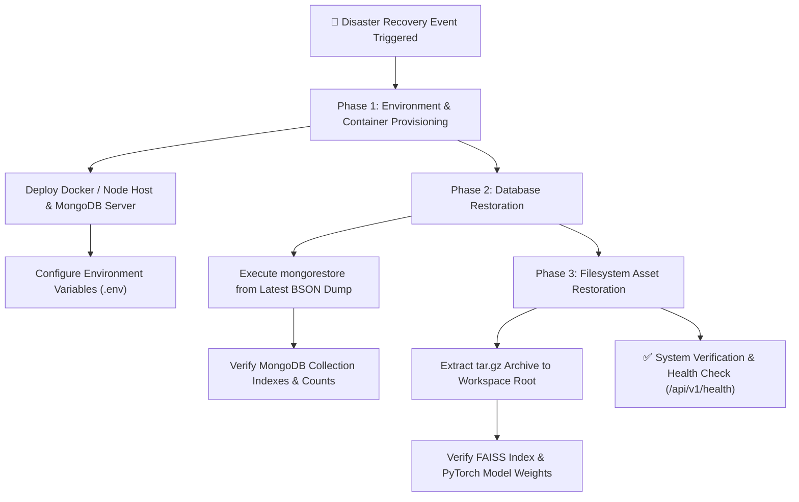

# 💾 Backup & Recovery Strategy – Agri Shield

## 1. Executive Summary

The **AI Crop Disease Detection System (Agri Shield)** manages critical agricultural data, including farmer user profiles, historical AI disease predictions, IoT field sensor telemetry, vector embeddings, and uploaded diagnostic leaf images. 

This document establishes the authoritative **Backup and Disaster Recovery Strategy**, defining operational procedures for snapshotting MongoDB database collections, archiving local filesystem assets (models, uploads, RAG vector stores), and executing rapid system restoration.

> [!IMPORTANT]
> **Strict Implementation Alignment:** All backup procedures detailed in Sections 2 and 3 reflect the active, self-hosted local infrastructure. External cloud object storage (AWS S3, Azure Blob, GCP Cloud Storage) is discussed strictly in Section 5 as an optional future deployment architecture.

---

## 2. Database Backup Procedures (MongoDB Community)

The platform relies on MongoDB Community Server (default database: `crop_disease_db`) to store structured transactional and time-series telemetry data across eight active collections: `users`, `predictions`, `farm_profiles`, `devices`, `iot_telemetry`, `kb_articles`, `revoked_tokens`, and `weather_cache`.

### 2.1 Full Database Snapshotting (`mongodump`)
To capture a point-in-time snapshot of all collections and indexes without interrupting active ASGI Uvicorn workers, system administrators execute the standard MongoDB dump utility:

```bash
# Execute local database snapshot (creates binary BSON dump in /backups/db/YYYY-MM-DD)
mongodump --uri="mongodb://localhost:27017" --db=crop_disease_db --out=/var/backups/agrishield/db/$(date +%F)
```

### 2.2 Backup Frequency & Retention Schedule (Local)
| Collection / Data Type | Snapshot Frequency | Local Retention Window | Storage Footprint Estimate | Operational Rationale |
| :--- | :---: | :---: | :---: | :--- |
| `users`, `farm_profiles` | Daily (Midnight UTC) | 30 Days | < 50 MB | Low-velocity transactional user accounts and field configurations. |
| `predictions`, `devices` | Daily (Midnight UTC) | 60 Days | 100 - 500 MB | Medium-velocity diagnostic history and hardware registry records. |
| `iot_telemetry` | Daily (Midnight UTC) | 14 Days (Raw Dump) | 1 - 5 GB | High-velocity time-series sensor transmissions; raw dumps pruned bi-weekly after aggregation. |
| `kb_articles`, `revoked_tokens`| Weekly (Sunday UTC)| 30 Days | < 20 MB | Static RAG reference metadata and temporary JWT blacklists. |

---

## 3. Filesystem Asset Archiving

In addition to structured MongoDB collections, Agri Shield maintains critical binary artifacts on the local server filesystem that require synchronized snapshotting.

### 3.1 Targeted Asset Directories
1. **Diagnostic Image Upload Buffer (`uploads/`):** Houses user-uploaded crop leaf images (`.jpg`, `.png`, `.webp`) referenced by `image_path` in `predictions` documents.
2. **ML Model Checkpoints (`model/`):** Contains trained PyTorch / Keras neural network weights (`.pt`, `.keras`, `.h5`) required for offline leaf image classification.
3. **RAG Vector Database (`knowledge_base/`):** Houses the compiled binary Euclidean index (`vector_store.faiss`), chunk registry (`kb_chunks.json`), and document hash manifest (`kb_manifest.json`).
4. **Security Audit Logs (`backend/logs/`):** Contains immutable, append-only security logs (`security_audit.log`).

### 3.2 Local Archive Execution (`tar`)
To bundle filesystem assets into a compressed, timestamped archive:
```bash
# Create gzip compressed archive of filesystem assets
tar -czvf /var/backups/agrishield/files/assets_$(date +%F).tar.gz \
    --exclude='uploads/*.tmp' \
    uploads/ model/ knowledge_base/ backend/logs/
```

---

## 4. Disaster Recovery (DR) & Restoration Procedures

In the event of hardware corruption, server migration, or database volume failure, system restoration follows a strict 3-phase sequence designed to achieve a Recovery Time Objective (RTO) of under 30 minutes.



### 4.1 Step-by-Step Restoration Commands
1. **Restore MongoDB Database:**
   ```bash
   mongorestore --uri="mongodb://localhost:27017" --db=crop_disease_db --drop /var/backups/agrishield/db/2026-07-26/crop_disease_db
   ```
2. **Restore Filesystem Artifacts:**
   ```bash
   tar -xzvf /var/backups/agrishield/files/assets_2026-07-26.tar.gz -C /path/to/workspace/
   ```
3. **Verify Service Integrity:**
   Invoke the backend diagnostic endpoint to verify database connectivity and model initialization:
   ```bash
   curl -X GET http://localhost:8000/api/v1/health
   ```

---

## 5. Optional Future Cloud Offloading (Not Present)

> [!NOTE]
> **Optional Future Enhancement:** The following cloud offloading strategies are **not implemented** in the current standalone release. They are documented here solely as architectural guidance for future enterprise or cloud-hosted deployments.

* **Automated Cloud S3 Replication (Optional):** Nightly backup scripts can be extended with AWS CLI or rclone to mirror compressed `mongodump` archives and filesystem tarballs to an Amazon S3 bucket, Azure Blob Storage, or GCP Cloud Storage container.
* **Cold Storage Lifecycle Policies (Optional):** Uploaded leaf images older than 180 days can be transitioned to AWS Glacier or Azure Archive storage tiers to minimize SSD storage costs while preserving historical diagnostic records.

---

## 6. Cross-References & Code Alignment

This Backup & Recovery Strategy aligns with:
* **Database ER Diagram & Collections:** [Overall Project Information/Database_ER_Diagram.md](file:///c:/AI%20Crop%20Disease%20Detection%20System/Overall%20Project%20Information/Database_ER_Diagram.md)
* **RAG Vector Index Persistence:** [Overall Project Information/RAG_Knowledge_Base_Architecture.md](file:///c:/AI%20Crop%20Disease%20Detection%20System/Overall%20Project%20Information/RAG_Knowledge_Base_Architecture.md)
* **Environment Variable Configurations:** [Overall Project Information/Environment_Configuration.md](file:///c:/AI%20Crop%20Disease%20Detection%20System/Overall%20Project%20Information/Environment_Configuration.md)
* **Backend Database Driver Integration:** [backend/app/db/mongodb.py](file:///c:/AI%20Crop%20Disease%20Detection%20System/backend/app/db/mongodb.py)
