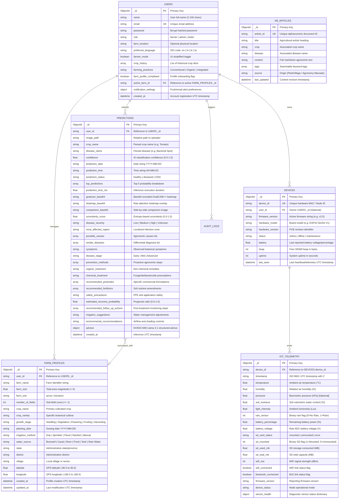

# 🗄️ Database Entity-Relationship (ER) Diagram & Schema Specification

## 1. Executive Summary

The **AI Crop Disease Detection System** utilizes a NoSQL document database architecture powered by **MongoDB Community 6.0+**. All database interaction is managed asynchronously via the **Motor** Python driver within the FastAPI backend. 

This document provides the formal **Entity-Relationship (ER) Diagram** and detailed schema specifications for all active database collections, reflecting the exact production-certified data models implemented in `backend/app/models/schemas.py`, `backend/app/models/farm_profile.py`, and `backend/app/routers/devices.py`.

---

## 2. Complete Entity-Relationship Diagram

The following Mermaid ER Diagram maps all core database collections, their attributes, primary/foreign key relationships, and cardinality across the system.

---

## 3. Detailed Collection Specifications

### 3.1 `users` Collection
* **Purpose:** Stores authenticated user accounts, encrypted credentials, role-based authorization levels, and customized farming preferences.
* **Indexes:**
  * `email_1` (Unique Ascending) — Enforces email uniqueness during registration and optimizes login lookups.
  * `role_1` (Ascending) — Facilitates administrative queries filtering by role (`farmer`, `admin`, `tester`).
* **Retention & Security:** Passwords are never stored in plaintext; they are hashed using `bcrypt` via Passlib prior to database insertion.

### 3.2 `predictions` Collection
* **Purpose:** Houses all AI crop disease classification records, generated GradCAM++ attention heatmaps, confidence scores, and structured treatment prescriptions.
* **Indexes:**
  * `user_id_1_created_at_-1` (Compound) — Optimizes paginated history queries (`/api/predict/history`) for individual farmers sorted by most recent diagnosis.
  * `crop_name_1_disease_name_1` (Compound) — Accelerates epidemiological analytics and disease prevalence reporting.
* **Retention Policy:** Images and high-resolution base64 heatmaps (> 6 months old) are candidates for cold storage archiving to conserve active MongoDB WiredTiger cache.

### 3.3 `farm_profiles` Collection
* **Purpose:** Stores geographical, botanical, and infrastructural profiles of agricultural fields managed by farmers.
* **Indexes:**
  * `user_id_1` (Ascending) — Rapid retrieval of all farm sectors associated with a specific user account.
  * `latitude_1_longitude_1` (2d / Compound) — Supports geospatial weather correlation and localized disease outbreak mapping.

### 3.4 `devices` & `iot_telemetry` Collections
* **Purpose:** `devices` maintains the state and health registry of ESP32 microcontrollers; `iot_telemetry` stores high-frequency time-series sensor transmissions (temperature, humidity, soil moisture, light, rain).
* **Indexes:**
  * `device_id_1` (Unique on `devices`) — Fast hardware node authentication and heartbeat updates.
  * `device_id_1_timestamp_-1` (Compound on `iot_telemetry`) — Vital for real-time dashboard charting and sliding-window anomaly detection.
* **Retention Policy:** High-frequency raw sensor telemetry is retained in active storage for 90 days, after which it is aggregated into hourly/daily statistical summaries for long-term seasonal analysis.

### 3.5 `kb_articles` Collection
* **Purpose:** Serves as the document repository for Agricultural Knowledge Base articles utilized during vector embedding generation and RAG prompt enrichment.
* **Indexes:**
  * `article_id_1` (Unique Ascending) — Prevents duplicate knowledge document ingestion.
  * `crop_1_disease_1` (Compound) — Allows fast deterministic keyword fallback lookups when vector search is offline.

---

## 4. Cross-References & Code Alignment

This ER diagram and schema specification directly corresponds to:
* **Backend Data Schemas:** [backend/app/models/schemas.py](file:///c:/AI%20Crop%20Disease%20Detection%20System/backend/app/models/schemas.py)
* **Farm Profile Models:** [backend/app/models/farm_profile.py](file:///c:/AI%20Crop%20Disease%20Detection%20System/backend/app/models/farm_profile.py)
* **Device Registration & Heartbeats:** [backend/app/routers/devices.py](file:///c:/AI%20Crop%20Disease%20Detection%20System/backend/app/routers/devices.py)
* **MongoDB Motor Lifecycle:** [backend/app/db/mongodb.py](file:///c:/AI%20Crop%20Disease%20Detection%20System/backend/app/db/mongodb.py)
* **System Architecture Context:** [Overall Project Information/Software_Architecture.md](file:///c:/AI%20Crop%20Disease%20Detection%20System/Overall%20Project%20Information/Software_Architecture.md)
