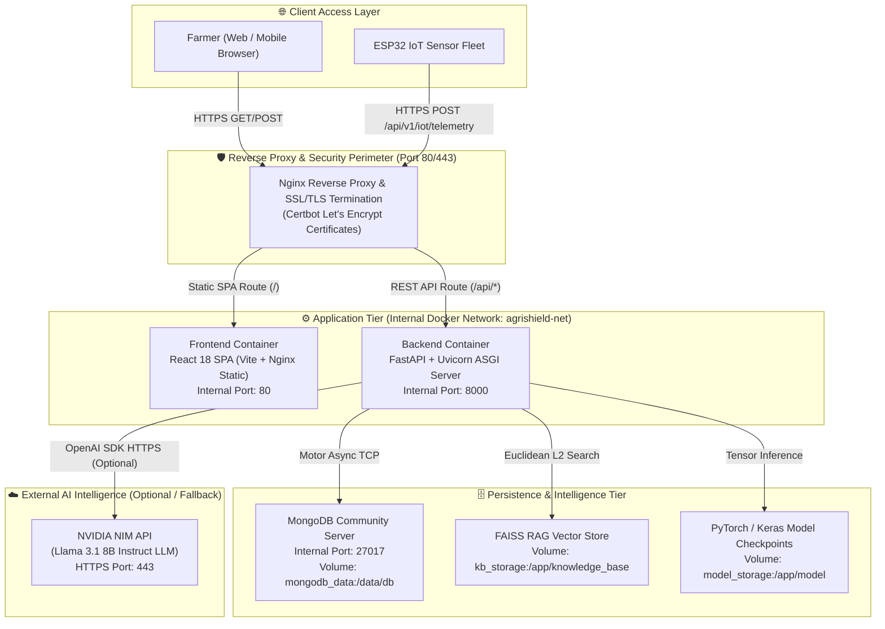

# 🚀 Deployment Architecture – Agri Shield

## 1. Executive Summary

The **AI Crop Disease Detection System (Agri Shield)** is architected as a highly modular, container-ready 3-tier web application designed for deployment across local on-premise servers, agricultural field stations, and scalable cloud infrastructures. 

This document details the complete **Deployment Architecture**, specifying the containerized service topology, reverse proxy routing rules, hardware resource sizing, SSL/TLS security boundaries, and horizontal scaling mechanics required to run the production-certified platform.

---

## 2. Multi-Container Deployment Topology

The production deployment relies on a decoupled, 3-tier containerized architecture orchestrated via Docker Compose (or Kubernetes in enterprise environments).

---

## 3. Reverse Proxy & Routing Rules (Nginx)

The edge layer utilizes an optimized Nginx reverse proxy to handle SSL/TLS termination, request buffering, CORS headers, and traffic routing between static frontend assets and the FastAPI backend server.

### 3.1 Routing Matrix
| Request Path Pattern | Target Upstream Service | Internal Port | Protocol | Timeout SLA |
| :--- | :--- | :---: | :---: | :---: |
| `/` or `/*` (Static Files) | `frontend-service` (React SPA) | `80` | HTTP/1.1 | 10 seconds |
| `/api/*` (REST Endpoints) | `backend-service` (FastAPI Uvicorn) | `8000` | HTTP/1.1 | 60 seconds (Uploads) |
| `/docs` or `/openapi.json` | `backend-service` (FastAPI Swagger UI)| `8000` | HTTP/1.1 | 15 seconds |
| `/ws/*` (Real-time Channels) | `backend-service` (WebSocket Manager) | `8000` | WS/WSS | 3600s (Keep-Alive) |

### 3.2 SSL/TLS Security Termination
* **Certificate Authority:** Automated Let's Encrypt certificates provisioned via Certbot.
* **TLS Protocols:** Strictly enforced TLS 1.2 and TLS 1.3; SSLv3, TLS 1.0, and TLS 1.1 are disabled.
* **Security Headers:** Nginx automatically injects `Strict-Transport-Security` (HSTS), `X-Content-Type-Options: nosniff`, and `X-Frame-Options: DENY` on all outgoing responses.

---

## 4. Hardware Resource Sizing & Capacity Planning

To guarantee sub-second REST API response times and under 2-second AI image classification latency, the following hardware allocation specifications are established based on our load certification benchmarks (150 concurrent workers at 1,377 RPS).

| Tier / Component | Minimum Specification (Local / Field Edge) | Recommended Production Specification (Server / Cloud) | Storage Requirement |
| :--- | :--- | :--- | :--- |
| **Frontend Container** | 1 vCPU, 512 MB RAM | 2 vCPU, 1 GB RAM | < 100 MB (Compiled Static Assets) |
| **Backend Container (CPU Mode)** | 2 vCPU, 2 GB RAM | 4 vCPU, 8 GB RAM | 5 GB (Model Weights + Upload Buffer) |
| **Backend Container (GPU Mode)** | **Not Present** (Optional: NVIDIA T4 / RTX 3060) | 8 vCPU, 16 GB RAM + 1× NVIDIA A10G / T4 GPU | 10 GB (CUDA Cache + PyTorch Tensors) |
| **MongoDB Database** | 1 vCPU, 1 GB RAM | 4 vCPU, 8 GB RAM (SSD backed) | 50 GB+ SSD (Indexed Collections & Telemetry) |
| **FAISS Vector Store** | Shared with Backend RAM | Shared with Backend RAM (Loaded into memory) | < 500 MB (IndexFlatL2 Binary + Chunks JSON) |
| **Total System Footprint** | **4 vCPU, 4 GB RAM** | **8+ vCPU, 16+ GB RAM** | **60 GB+ NVMe SSD** |

---

## 5. Scalability & Degradation Strategy

### 5.1 Horizontal Pod / Container Scaling
* **Stateless Backend:** The FastAPI backend is completely stateless; authentication JWTs contain signed user identities, and AI models are loaded into local process memory upon worker initialization. Consequently, `backend-service` containers can be horizontally scaled across multiple CPU nodes behind an Nginx load balancer without session affinity (sticky sessions) restrictions.
* **Uvicorn Worker Concurrency:** For single-node deployments, Uvicorn is configured to run with `workers = (2 x CPU_CORES) + 1` to maximize asynchronous event loop throughput during heavy I/O database queries and image processing.

### 5.2 Graceful Degradation & Resilience
* **Sliding Window Rate Limiter:** Implemented in `backend/app/core/rate_limiter.py`, the system actively monitors request burst rates per client IP and JWT token. When burst traffic exceeds thresholds (e.g., > 60 telemetry pings per minute per IoT node), the server returns `HTTP 429 Too Many Requests` to prevent CPU exhaustion.
* **Offline / Degraded Mode:** If the MongoDB persistence layer experiences temporary disconnection or restarts, the backend automatically transitions to Degraded Mode. Core diagnostic endpoints (`/api/v1/health`) and cached weather intelligence remain operational (`HTTP 200`), preventing cascading unhandled server crashes.

---

## 6. Cloud & Enterprise Orchestration (Optional / Not Present)

> [!NOTE]
> **Cloud Provider Neutrality:** The core Agri Shield platform is self-contained and does not mandate AWS, Microsoft Azure, or Google Cloud Platform (GCP) proprietary services. It runs natively on any Linux/Windows Docker host or bare-metal server.

* **Kubernetes (K8s) Mapping (Optional):** If deployed to Kubernetes, Nginx maps to an **Ingress Controller**, Frontend and Backend deploy as stateless **Deployments** with Horizontal Pod Autoscalers (HPA), and MongoDB deploys as a **StatefulSet** backed by Persistent Volume Claims (PVC).
* **Managed Database Fallback (Optional):** Self-hosted MongoDB Community containers can be seamlessly swapped for managed DBaaS instances (e.g., MongoDB Atlas or AWS DocumentDB) simply by updating the `MONGODB_URI` environment connection string.

---

## 7. Cross-References & Code Alignment

This Deployment Architecture aligns with:
* **System Architecture Overview:** [Overall Project Information/Software_Architecture.md](file:///c:/AI%20Crop%20Disease%20Detection%20System/Overall%20Project%20Information/Software_Architecture.md)
* **Backend ASGI Lifecycle:** [Overall Project Information/Backend_Architecture.md](file:///c:/AI%20Crop%20Disease%20Detection%20System/Overall%20Project%20Information/Backend_Architecture.md)
* **Frontend SPA Routing:** [Overall Project Information/Frontend_Architecture.md](file:///c:/AI%20Crop%20Disease%20Detection%20System/Overall%20Project%20Information/Frontend_Architecture.md)
* **Rate Limiting & Security Defenses:** [backend/app/core/rate_limiter.py](file:///c:/AI%20Crop%20Disease%20Detection%20System/backend/app/core/rate_limiter.py)
