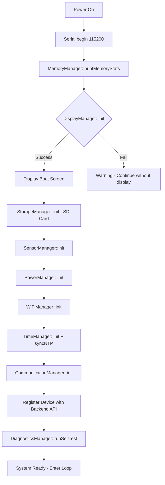

# ⚙️ ESP32 Firmware Architecture – Agri Shield

## Overview

The Agri Shield ESP32 firmware is built using the **Arduino framework via PlatformIO**. It follows a **modular manager-based architecture** where each hardware subsystem or software utility is encapsulated in a dedicated `Manager` class stored in the `lib/` directory.

The firmware has two build modes:
1. **HARDWARE_TEST_OLED** (`#define HARDWARE_TEST_OLED 1`) – For isolated OLED hardware validation without sensors.
2. **PRODUCTION MODE** (default) – Runs the full sensor + WiFi + API pipeline.

---

## PlatformIO Configuration

**File:** `hardware/esp32_v1/platformio.ini`

```ini
[env:esp32dev]
platform = espressif32
board = esp32dev
framework = arduino
monitor_speed = 115200
upload_speed = 921600
lib_deps =
    bblanchon/ArduinoJson @ ^6.21.3
    adafruit/DHT sensor library @ ^1.4.4
    adafruit/Adafruit Unified Sensor @ ^1.1.9
    adafruit/Adafruit SSD1306 @ ^2.5.7
    adafruit/Adafruit GFX Library @ ^1.11.5
    claws/BH1750 @ ^1.3.0
```

---

## Firmware Folder Structure

```
hardware/esp32_v1/
├── platformio.ini              # Build and dependency configuration
├── src/
│   ├── main.cpp                # Entry point (setup + loop)
│   ├── core/
│   │   ├── MemoryManager.h/cpp # Heap monitoring
│   │   └── ErrorManager.h/cpp  # Error state handling
│   ├── constants/              # Firmware-wide constants (pins, thresholds)
│   └── tests/                  # Hardware test code
└── lib/
    ├── ApiManager/             # HTTP API calls to backend
    ├── CalibrationManager/     # Sensor calibration constants
    ├── CommunicationManager/   # HTTP/MQTT transport layer
    ├── DiagnosticsManager/     # Self-test routines
    ├── DisplayManager/         # OLED rendering (all pages)
    ├── EventManager/           # Event pub/sub system
    ├── GraphicsManager/        # Bitmap icons for OLED
    ├── JsonManager/            # JSON build/parse utilities
    ├── Logger/                 # Serial debug logging
    ├── OTAManager/             # Over-the-air firmware update
    ├── PowerManager/           # Battery + power state logic
    ├── PreferencesManager/     # NVS persistent storage
    ├── SensorManager/          # All sensor read operations
    ├── StorageManager/         # SD card read/write
    ├── SystemData/             # Shared data singleton (structs)
    ├── TimeManager/            # NTP sync + time formatting
    ├── WiFiManager/            # WiFi connect/reconnect state machine
    └── WidgetManager/          # Reusable OLED UI widget helpers
```

---

## Production Firmware Boot Sequence



---

## Main Loop Architecture

The production `loop()` runs three non-blocking timed intervals:

```
┌──────────────────────────────────────────────────────────┐
│                    MAIN LOOP (non-blocking)               │
│                                                          │
│  Every 100ms (10 FPS):                                   │
│    - DisplayManager::update()  → Refresh OLED display    │
│    - WiFiManager::handle()     → Manage connection state │
│                                                          │
│  Every 10 seconds (Telemetry - validation builds):       │
│    - SensorManager::readTemperature()                    │
│    - SensorManager::readHumidity()                       │
│    - SensorManager::readLight()                          │
│    - SensorManager::readSoil()                           │
│    - SensorManager::readRain()                           │
│    - SensorManager::readBattery()                        │
│    - PowerManager::evaluatePowerState()                  │
│    - JsonManager::buildTelemetryJson()                   │
│    - CommunicationManager::sendTelemetry(payload)        │
│                                                          │
│  Every 30 seconds (Heartbeat):                           │
│    - ApiManager::sendHeartbeat()   (if WiFi connected)   │
└──────────────────────────────────────────────────────────┘
```

> [!NOTE]
> In production deployment, telemetry interval should be increased to 300 seconds (5 minutes) and heartbeat to 900 seconds (15 minutes) to conserve battery.

---

## Manager Modules – Detailed Reference

### 1. `SystemData` – Shared Data Singleton
**Role:** A global singleton struct that holds all live sensor readings, network state, and system state. All managers read from and write to `SystemData`.

**Key Structs:**
- `SD_Sensors` – temperature, humidity, soil, light, rain, battery
- `SD_Network` – WiFi state, SSID, IP, RSSI, NTP time, backend status
- `SD_System` – activePage, firmwareVersion, uptime, SD card mounted

---

### 2. `DisplayManager` – OLED Rendering
**Role:** Renders the multi-page OLED UI at 10 FPS using Adafruit SSD1306 + GFX libraries.

**Key Functions:**
- `DisplayManager::init()` → Initialize I2C + OLED hardware
- `DisplayManager::update()` → Select current page, render, flush display buffer
- `DisplayManager::setPage(int page)` → Manually change active page

---

### 3. `SensorManager` – Sensor Reading
**Role:** Interfaces with all 4 sensors and writes results to `SystemData::sensors`.

**Key Functions:**
- `readTemperature()` → AHT10 I2C read → updates `SD_Sensors.temperature`
- `readHumidity()` → AHT10 I2C read → updates `SD_Sensors.humidity`
- `readLight()` → BH1750 I2C read → updates `SD_Sensors.lightIntensity`
- `readSoil()` → ADC read GPIO 34 → maps to % → updates `SD_Sensors.soilMoisture`
- `readRain()` → ADC read GPIO 35 → maps to 0/1 → updates `SD_Sensors.rainDetected`
- `readBattery()` → ADC read GPIO 36 → calculates V + % → updates battery fields

---

### 4. `WiFiManager` – WiFi State Machine
**Role:** Manages WiFi connection lifecycle with automatic reconnection. Uses a non-blocking state machine pattern.

**States:**

| State | Description |
|-------|-------------|
| `DISCONNECTED` | Not connected to any AP |
| `SCANNING` | Searching for known SSIDs |
| `CONNECTING` | Association in progress |
| `CONNECTED` | Active connection established |
| `RECONNECTING` | Re-connecting after drop |
| `FAILED` | Connection failed (too many retries) |

**Key Functions:**
- `WiFiManager::init()` → Load credentials from NVS, start connection
- `WiFiManager::handle()` → State machine tick (called every 100ms)
- `WiFiManager::isConnected()` → Returns bool

---

### 5. `ApiManager` – Backend Communication
**Role:** Handles all outbound HTTP requests to the FastAPI backend API.

**Key Functions:**
- `sendTelemetry(String json)` → POST to `/api/v1/iot/telemetry`
- `sendHeartbeat()` → POST to `/api/v1/iot/heartbeat`
- `registerDevice()` → POST to `/api/v1/devices/register`
- `fetchConfig(String deviceId)` → GET `/api/v1/devices/{id}/config`
- `checkOTA(String version)` → GET `/api/v1/devices/{id}/ota`

---

### 6. `CommunicationManager` – Transport Layer
**Role:** Abstraction layer between `ApiManager` and the underlying protocol (HTTP or MQTT). Handles offline SD queuing when WiFi is unavailable.

**Protocols Supported:**
- `CommProtocol::HTTP` – Standard REST over TCP (Phase 1)
- `CommProtocol::MQTT` – MQTT over TCP (Phase 2 planned)

**Offline Fallback:**
When WiFi is unavailable, `sendTelemetry()` calls `StorageManager::queuePayload()` to save the JSON to SD card. On next successful WiFi connection, queued payloads are flushed to the backend.

---

### 7. `StorageManager` – SD Card
**Role:** Manages all SD card operations including initialization, file write, and offline payload queueing.

**Key Functions:**
- `StorageManager::init()` → Mount SD card via SPI (GPIO 5, 18, 19, 23)
- `logTelemetry(String json)` → Append to `/data/YYYY-MM-DD.json`
- `queuePayload(String json)` → Save to `/queue/pending.json` for later upload
- `flushQueue()` → Read and upload all pending payloads then delete

---

### 8. `PowerManager` – Battery & Power State
**Role:** Reads battery percentage, monitors charging state via GPIO 4 (TP4056 CHRG pin), and adjusts system behavior based on battery level.

**Power States:**

| State | Battery % | Action |
|-------|-----------|--------|
| `FULL` | 85–100% | Normal operation |
| `NORMAL` | 50–85% | Normal operation |
| `LOW` | 20–50% | Normal, show warning on OLED |
| `CRITICAL` | 0–20% | Reduce sensor polling frequency |
| `CHARGING` | Any | USB connected |

---

### 9. `TimeManager` – NTP Sync
**Role:** Synchronizes system time via NTP after WiFi connection and provides formatted time strings.

**Key Functions:**
- `TimeManager::init()` → Set timezone (IST: UTC+5:30)
- `TimeManager::syncNTP()` → Connect to `pool.ntp.org` and sync
- `TimeManager::getTimeString()` → Returns `"HH:MM"` for OLED display
- `TimeManager::getISOTimestamp()` → Returns ISO 8601 string for JSON payloads

---

### 10. `JsonManager` – JSON Builder
**Role:** Builds the telemetry JSON payload from `SystemData` to send to the backend.

**Output JSON format:**
```json
{
  "device_id": "ESP32_AA:BB:CC:DD:EE:FF",
  "timestamp": "2026-07-16T18:00:00Z",
  "temperature": 28.5,
  "humidity": 64.2,
  "soil_moisture": 42.5,
  "light_intensity": 8542.0,
  "rain_sensor": 0,
  "battery_percentage": 78.0,
  "sd_card_status": "mounted",
  "wifi_rssi": -52,
  "firmware_version": "v2.4.1",
  "device_status": "online",
  "sensor_health": {
    "aht10": "ok",
    "bh1750": "ok",
    "soil": "ok",
    "rain": "ok"
  }
}
```

---

### 11. `Logger` – Serial Debug
**Role:** Provides formatted serial logging with levels: `info`, `warning`, `error`, `debug`.

```cpp
Logger::info("WiFi connected to MyFarm");
Logger::error("CRITICAL HALT: DisplayManager failed");
Logger::warning("Battery below 20%");
```

---

### 12. `OTAManager` – Over-the-Air Update (Planned)
**Role:** Checks the backend API for firmware updates and downloads + applies `.bin` file via HTTP OTA.

**Status:** Endpoint exists in backend (`/api/v1/devices/{id}/ota`), but OTA download and apply logic is **not yet implemented** in the firmware. Planned for Phase 2.

---

### 13. `DiagnosticsManager` – Self-Test
**Role:** Runs a boot-time self-test to verify all hardware components are responding.

**Tests performed:**
1. I2C scan for expected device addresses (0x38, 0x23, 0x3C)
2. OLED display render check
3. SD card mount check
4. ADC sanity check (soil, rain, battery channels)
5. WiFi SSID visibility check

---

### 14. `PreferencesManager` – NVS Storage
**Role:** Read/write persistent configuration from ESP32 Non-Volatile Storage (NVS).

**Stored keys:**
- `wifi_ssid` – Last connected WiFi SSID
- `wifi_pass` – WiFi password
- `device_id` – Persistent unique device ID
- `api_url` – Backend server URL
- `telemetry_interval` – Sensor polling interval (ms)

---

### 15. `CalibrationManager` – Sensor Calibration
**Role:** Stores and retrieves sensor calibration constants.

**Calibration values stored:**
- `soil_dry` – Raw ADC value in completely dry conditions (default: 3100)
- `soil_wet` – Raw ADC value in water (default: 1200)
- `vdiv_factor` – Voltage divider scale factor (default: 2.0)

---

### 16. `GraphicsManager` – OLED Bitmaps
**Role:** Stores all bitmap icon arrays for OLED rendering.

---

### 17. `EventManager` – Event Bus
**Role:** Simple pub/sub event system for inter-manager communication without tight coupling.

---

### 18. `WidgetManager` – OLED Widgets
**Role:** Reusable UI widget functions (progress bars, status badges, bordered boxes) for OLED display pages.
