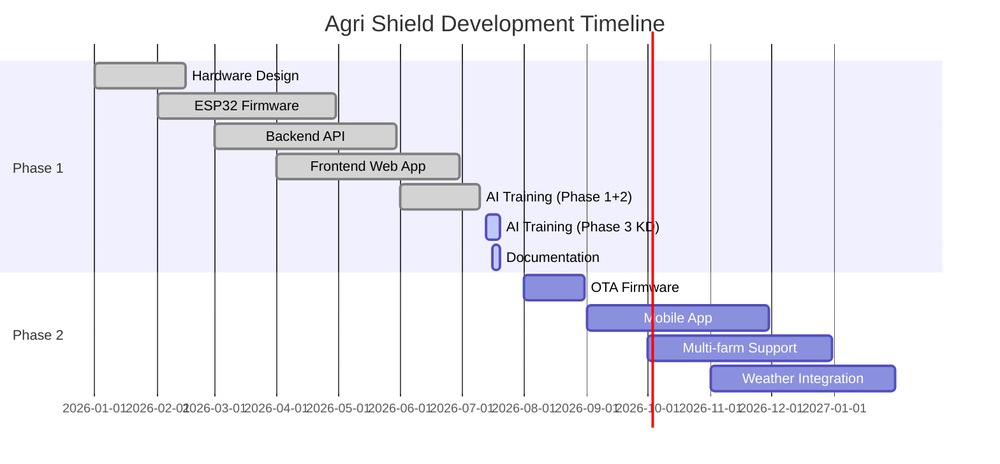

# 🗺️ Feature Roadmap – Agri Shield

## Overview

This document categorizes all features of the Agri Shield project into their current implementation status.

---

## ✅ Implemented Features

### Hardware
| Feature | Component | Notes |
|---------|-----------|-------|
| Temperature sensing | AHT10 I2C sensor | ±0.3°C accuracy |
| Humidity sensing | AHT10 I2C sensor | ±2% RH accuracy |
| Light intensity sensing | BH1750 I2C sensor | 0–65535 Lux |
| Soil moisture sensing | Capacitive sensor v1.2 | Calibrated to % |
| Rain detection | Analog rain sensor | 0/1 binary output |
| Battery monitoring | ADC voltage divider + TP4056 CHRG pin | % + charging status |
| OLED display | SH1106 1.3" 128×64 | 4 pages at 10 FPS |
| SD card local logging | SPI MicroSD module | JSON log files per day |
| WiFi connectivity | ESP32 built-in 802.11b/g/n | State machine management |
| NTP time sync | TimeManager | IST UTC+5:30 |
| Device registration | ApiManager → backend | On every boot |
| Telemetry upload | CommunicationManager → POST /api/v1/iot/telemetry | Every 10 seconds |
| Heartbeat reporting | ApiManager → POST /api/v1/iot/heartbeat | Every 30 seconds |
| Offline SD queuing | StorageManager queue | Syncs on WiFi reconnect |
| Battery charging | TP4056 CC/CV charger | Via USB |
| Boost converter | MT3608 3.7V → 5V | For ESP32 power |
| Self-test diagnostics | DiagnosticsManager | On boot |
| Serial debug logging | Logger (info/warn/error) | 115200 baud |

### Backend
| Feature | Endpoint | Notes |
|---------|----------|-------|
| User registration | POST /api/auth/register | bcrypt password hash |
| User login with JWT | POST /api/auth/login | 24h token expiry |
| JWT authentication | All protected routes | python-jose HS256 |
| Profile view | GET /api/auth/profile | Returns user data |
| Profile update | PUT /api/auth/profile | Name, password, language, location |
| Leaf image upload | POST /api/upload | UUID naming, magic byte validation, 10MB limit |
| AI disease prediction | POST /api/predict | MobileNetV3 + GradCAM++ |
| Prediction history | GET /api/history | Pagination, search, status filter |
| Prediction deletion | DELETE /api/history/{id} | Deletes record + image file |
| AI model health check | GET /api/ai/model/status | Validates TF model loaded |
| Farming advice (LLM) | POST /api/ai/farming-assistant | NVIDIA NIM Llama 3.1 |
| AI chat | POST /api/ai/chat | Multi-turn conversation |
| NVIDIA API test | GET /api/ai/test | Connection health check |
| IoT telemetry ingest | POST /api/v1/iot/telemetry | Stores to MongoDB |
| IoT heartbeat | POST /api/v1/iot/heartbeat | Updates device uptime |
| Device registration | POST /api/v1/devices/register | Upsert device document |
| Device status | GET /api/v1/devices/status | All devices with latest telemetry |
| Device config | GET /api/v1/devices/{id}/config | Backend-driven ESP32 config |
| OTA check endpoint | GET /api/v1/devices/{id}/ota | Returns update available flag |
| API versioning | /api/v1/* | Dynamic V1 router |
| CORS | CORSMiddleware | All origins in dev mode |
| Static file serving | /uploads/* | Uploaded images served |
| Mock AI mode | nvidia_service.py | Works without API key |

### Frontend
| Feature | Page | Notes |
|---------|------|-------|
| Public landing page | LandingPage | Hero, features, CTA |
| User registration form | RegisterPage | All profile fields |
| User login form | LoginPage | JWT storage in localStorage |
| Protected routes | ProtectedRoute | Auto-redirect to /login |
| Dashboard | DashboardPage | Sensor data + recent predictions |
| Leaf image upload | UploadImagePage | Drag-drop + file validation |
| Prediction results | PredictionResultPage | Heatmap + advice + confidence |
| Prediction history | HistoryPage | Search, filter, pagination, delete |
| Device monitoring | DevicesPage | ESP32 status + latest telemetry |
| Analytics charts | AnalyticsPage | Recharts disease + sensor charts |
| Report generation | ReportsPage | CSV download |
| AI chatbot | AIAssistantPage | Multi-turn chat with context |
| Profile management | ProfilePage | Edit name, password, location, language |
| Language settings | SettingsPage | Switch between 6 languages |
| i18n support | All pages | 6 languages via i18next |
| JWT auth context | AuthContext | Global user state |
| Lazy loading | Heavy pages | Reduced initial bundle |
| 404 error page | NotFoundPage | Catch-all redirect |

### AI/ML
| Feature | File | Notes |
|---------|------|-------|
| Dataset preparation | prepare_dataset.py | Scan, validate, export classes |
| Phase 1 training | train.py Phase 1 | Head training, 15 epochs |
| Phase 2 fine-tuning | train.py Phase 2 | Partial unfreeze, partial |
| Phase 3 KD training | train.py Phase 3 | Knowledge Distillation, ongoing |
| GradCAM++ heatmap | predict.py | Visual explainability |
| OOD rejection | predict.py | Confidence threshold filter |
| Top-5 predictions | predict.py | Alternative class probabilities |
| Disease severity | predict.py | Low/Medium/High from heatmap |
| Uncertainty score | predict.py | 1 - max_confidence |
| Training monitor | utils/monitor.py | Live log file updates |
| Training control | utils/control_training.py | Pause/resume/status |

---

## 🔄 In Progress Features

| Feature | Status | Notes |
|---------|--------|-------|
| Knowledge Distillation (Phase 3) | Epoch 7/15 | Training on CPU, ~8hrs remaining |
| Model accuracy improvement | In training | Target: >75% validation accuracy |
| PDF report download | Partially implemented | jsPDF integrated, export needs polish |
| Notifications system | UI exists | Backend notification logic not implemented |

---

## 📋 Planned Features (Phase 1 Completion)

| Feature | Priority | Description |
|---------|----------|-------------|
| OTA firmware update | High | Apply firmware update from backend |
| Push notifications (browser) | High | PWA notifications for disease alerts |
| PDF report completion | High | Fix jsPDF export with all prediction data |
| Prediction confidence calibration | Medium | Isotonic regression post-calibration |
| Device deep sleep mode | Medium | Reduce power consumption by 10× |
| Multi-class balanced training | Medium | Handle class imbalance with weighted loss |

---

## 🚀 Future Enhancements (Phase 2+)

| Feature | Category | Description |
|---------|----------|-------------|
| Multi-device support | Hardware | Multiple ESP32 nodes per farm account |
| GPS location tagging | Hardware | Tag predictions with GPS coordinates |
| Weather forecast integration | AI | OpenWeatherMap API for predictive alerts |
| Irrigation recommendation | AI | Based on soil + weather + crop type |
| Fertilizer recommendation | AI | Nutrient deficit analysis |
| Crop growth monitoring | AI | Sequential leaf scans to track progression |
| Pest detection | AI | Separate ML model for pest identification |
| Disease severity score (0–100) | AI | Fine-grained severity beyond Low/Med/High |
| Voice assistant | Frontend | Web Speech API for illiterate farmers |
| Voice input (regional) | Frontend | Hindi/Telugu voice commands |
| Mobile app | Mobile | React Native or PWA mobile app |
| Multi-farm support | Backend | Multiple farm locations per account |
| Crop calendar | Backend | Planting season recommendations |
| Analytics: seasonal trends | Analytics | Disease frequency by season/month |
| Satellite imagery | Integration | NDVI crop health index |
| SMS alerts | Integration | Disease alert via SMS (no internet needed) |
| Peer farming community | Social | Farmer-to-farmer discussion platform |
| Edge AI inference | Hardware | Run lightweight model on ESP32-S3 |

---

## Implementation Timeline

