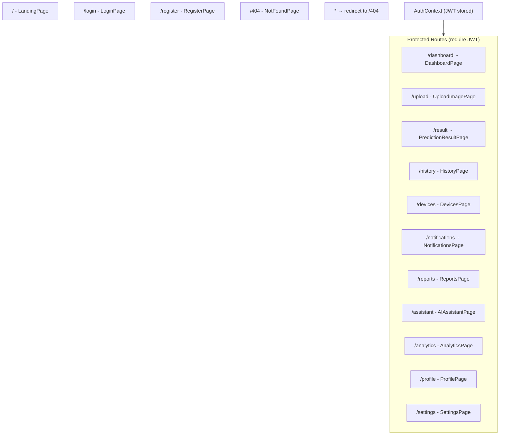

# 🖥️ Frontend Architecture – Agri Shield React App

## Overview

The Agri Shield frontend is a **React 18 Single Page Application (SPA)** built with **Vite 4** and styled using **TailwindCSS 3**. It uses **React Router v6** for client-side routing, **Axios** for API communication, **i18next** for multilingual support, and **Recharts** for analytics visualizations.

---

## Frontend Folder Structure

```
frontend/
├── index.html                  # HTML entrypoint (Vite root)
├── package.json                # Node package manifest
├── vite.config.js              # Vite dev server + proxy configuration
├── tailwind.config.js          # TailwindCSS configuration
├── postcss.config.js           # PostCSS pipeline configuration
└── src/
    ├── main.jsx                # React DOM bootstrap entrypoint
    ├── App.jsx                 # Root component: router + layout wrapper
    ├── index.css               # Global base CSS
    ├── context/
    │   └── AuthContext.jsx     # React Context for JWT auth state
    ├── components/
    │   ├── ProtectedRoute.jsx  # Route guard (redirects to /login if unauthenticated)
    │   ├── UI.jsx              # Shared UI: Navbar, Sidebar, Footer
    │   └── dashboard/          # Dashboard-specific sub-components
    ├── pages/
    │   ├── LandingPage.jsx     # Public marketing/hero page
    │   ├── LoginPage.jsx       # User login form
    │   ├── RegisterPage.jsx    # User registration form
    │   ├── DashboardPage.jsx   # Main sensor + prediction overview
    │   ├── UploadImagePage.jsx # Leaf image upload interface
    │   ├── PredictionResultPage.jsx # AI diagnosis result + heatmap
    │   ├── HistoryPage.jsx     # Prediction history + filter/search
    │   ├── PredictionHistoryPage.jsx # Alternative history view
    │   ├── DevicesPage.jsx     # ESP32 device monitoring
    │   ├── AnalyticsPage.jsx   # Charts + analytics
    │   ├── ReportsPage.jsx     # Report generation (CSV + PDF)
    │   ├── AIAssistantPage.jsx # Chatbot interface
    │   ├── NotificationsPage.jsx # System notifications
    │   ├── ProfilePage.jsx     # User profile management
    │   ├── SettingsPage.jsx    # App settings + language
    │   └── NotFoundPage.jsx    # 404 error page
    ├── services/
    │   └── api.js              # Axios instance (base URL, interceptors, auth header)
    └── i18n/
        ├── config.js           # i18next initialization configuration
        └── translations.js     # All language translation strings (6 languages)
```

---

## Application Routing

**File:** `src/App.jsx`



### Layout Structure
All protected routes use the `DashboardLayout` wrapper:
```
DashboardLayout
├── Navbar (top bar, hamburger menu, user avatar)
├── Sidebar (left nav, collapsible on mobile)
└── Main content area (Outlet → active page)
    └── Footer
```

---

## State Management

The app uses **React Context API** for global state (no Redux needed at this scale).

### `AuthContext` – Authentication State

**File:** `src/context/AuthContext.jsx`

| State Property | Type | Description |
|---------------|------|-------------|
| `user` | Object/null | Current user profile from JWT |
| `token` | String/null | JWT access token |
| `isAuthenticated` | Boolean | Whether user is logged in |
| `login(token, user)` | Function | Store token + user, redirect to dashboard |
| `logout()` | Function | Clear token + user, redirect to / |

**Storage:** Token is stored in `localStorage` under key `token`. On app load, `AuthContext` reads from `localStorage` to restore session.

---

## Page Descriptions

### LandingPage (`/`)
**Purpose:** Marketing page for visitors. Features hero section, feature cards, tech stack highlights, and CTAs to login/register.

**Key Sections:**
- Hero: "AI-Powered Crop Disease Detection"
- Feature cards: IoT monitoring, AI detection, multilingual support
- System stats: 88,979 training images, 85 disease classes, 6 languages
- CTA buttons: "Get Started" → /register, "Login" → /login

---

### LoginPage (`/login`)
**Purpose:** User authentication form.

**Form Fields:** Email, Password, Remember Me checkbox

**API Call:** `POST /api/auth/login`

**On Success:** Store JWT in AuthContext, redirect to `/dashboard`

---

### RegisterPage (`/register`)
**Purpose:** New user registration.

**Form Fields:** Full Name, Email, Password, Farm Location (optional), Preferred Language (dropdown), Farming Practices (dropdown)

**API Call:** `POST /api/auth/register`

---

### DashboardPage (`/dashboard`)
**Purpose:** Central monitoring hub showing:
- Farm Health Score (aggregate of sensor readings)
- ESP32 device status panel
- Environment summary (temp, humidity, soil, light, rain)
- Recent AI predictions list
- Quick action button: "AI Disease Scan"
- Mobile Access QR code (device QR)

**Data Sources:**
- `GET /api/v1/devices/status` → Device + latest telemetry
- `GET /api/history?limit=5` → Recent predictions

---

### UploadImagePage (`/upload`)
**Purpose:** Leaf image capture and upload.

**Flow:**
1. Farmer selects or drags-and-drops a leaf image (JPG/PNG ≤ 10MB)
2. Preview shown with file info
3. "Analyze Crop" button → `POST /api/upload` → returns `image_path`
4. Navigate to `/result` with `image_path` in router state

---

### PredictionResultPage (`/result`)
**Purpose:** Display complete AI diagnosis results.

**Displays:**
- Original uploaded leaf image
- GradCAM++ heatmap overlay (shows disease region)
- Predicted disease name + crop name
- Confidence score (%)
- Disease severity (Low/Medium/High)
- Most affected leaf region
- Top 5 alternative predictions (with confidence bars)
- Possible causes list
- Similar diseases list
- AI farming advice (from NVIDIA NIM):
  - Disease explanation
  - Organic treatment
  - Chemical treatment
  - Prevention methods
  - Farmer-friendly advice

---

### HistoryPage (`/history`)
**Purpose:** Browse all past predictions with search and filter.

**Features:**
- Search by crop name or disease name
- Filter by status (healthy/diseased)
- Pagination (10 per page)
- Delete prediction record (with image cleanup on backend)

**API Calls:**
- `GET /api/history?page=1&limit=10&search=...&status=...`
- `DELETE /api/history/{id}`

---

### DevicesPage (`/devices`)
**Purpose:** Monitor connected ESP32 hardware nodes.

**Displays:**
- Device ID, firmware version, hardware model
- Online/offline status + last seen timestamp
- Live sensor readings from latest telemetry
- Battery level indicator
- SD card status

**API Call:** `GET /api/v1/devices/status`

---

### AnalyticsPage (`/analytics`)
**Purpose:** Visual analytics and charts.

**Charts (using Recharts):**
- Disease distribution pie chart
- Prediction trends line chart (over time)
- Sensor reading history charts (temp, humidity, soil)
- Crop-specific disease frequency bar chart

---

### ReportsPage (`/reports`)
**Purpose:** Generate downloadable reports.

**Export formats:**
- CSV download of prediction history
- PDF report (using jsPDF + jsPDF-AutoTable)

**Report contents:**
- User profile header
- Date range summary
- Prediction records table
- Farm health metrics

---

### AIAssistantPage (`/assistant`)
**Purpose:** Interactive agricultural chatbot.

**Features:**
- Chat input field with send button
- Message history display (user messages + AI responses)
- Context menu: attach recent prediction data to chat context
- Language-aware responses (sends `preferred_language` with each request)

**API Call:** `POST /api/ai/chat { message, history, context }`

---

### ProfilePage (`/profile`)
**Purpose:** View and update user profile.

**Editable Fields:**
- Full name
- Farm location
- Password (change)
- Preferred language
- Farming practices

**API Calls:**
- `GET /api/auth/profile`
- `PUT /api/auth/profile`

---

### SettingsPage (`/settings`)
**Purpose:** Application configuration.

**Settings available:**
- Language selection (6 languages)
- Notification preferences (planned)
- Theme toggle (dark/light – planned)

---

## API Service Configuration

**File:** `src/services/api.js`

```javascript
// Axios instance base configuration
axios.defaults.baseURL = 'http://localhost:8000';

// Request interceptor: attach JWT token
config.headers.Authorization = `Bearer ${token}`;

// Response interceptor: handle 401 (auto-logout)
if (error.response?.status === 401) {
  logout();
  navigate('/login');
}
```

---

## Lazy Loading

Heavy pages are **lazy loaded** using `React.lazy()` to reduce initial bundle size:

```
Eagerly loaded (small):
  - LandingPage, LoginPage, RegisterPage, DashboardPage, UploadImagePage, ReportsPage

Lazy loaded (heavy):
  - PredictionResultPage, HistoryPage, DevicesPage, NotificationsPage
  - ProfilePage, SettingsPage, AIAssistantPage, AnalyticsPage
```

A spinner (`animate-spin rounded-full`) is shown as `Suspense` fallback during lazy load.

---

## Vite Configuration

**File:** `frontend/vite.config.js`

- Dev server port: **3000**
- API proxy: Requests to `/api` proxied to `http://localhost:8000`
- Hot Module Replacement (HMR): Enabled for fast development

---

## Starting the Frontend

```powershell
# Navigate to frontend directory
cd "c:\AI Crop Disease Detection System\frontend"

# Install dependencies (first time only)
npm install

# Start development server
npm run dev
# → http://localhost:3000/
```
