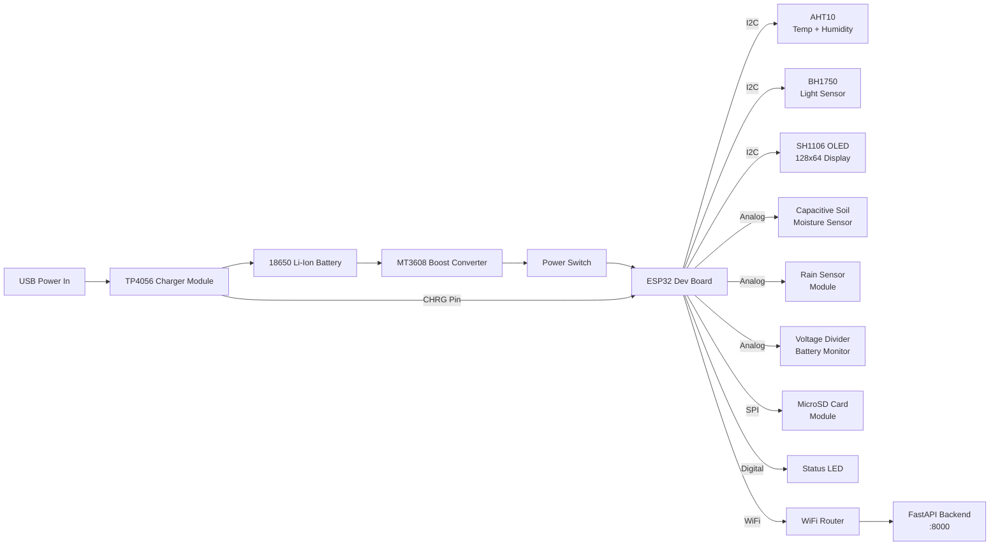

# 🔌 Hardware Architecture – Agri Shield ESP32 Node

## Overview

The Agri Shield hardware node is a custom IoT device built around the **ESP32 Dual-Core 240MHz microcontroller**. It collects real-time environmental data from 4 sensor types, displays live information on an OLED screen, logs data to an SD card, and transmits JSON telemetry to the backend API over WiFi.

---

## Hardware Block Diagram

```
                    ┌─────────────────────────────────────────┐
                    │           POWER MANAGEMENT               │
                    │                                          │
  USB/Solar ──────► │ TP4056 Charger ──► 18650 Battery        │
                    │                       │                  │
                    │                  MT3608 Boost            │
                    │                  Converter               │
                    │                  5V Output               │
                    └─────────────────────┬───────────────────┘
                                          │ 5V
                                          ▼
                    ┌─────────────────────────────────────────┐
                    │            ESP32 Dev Board               │
                    │         (240MHz, 520KB SRAM)             │
                    │                                          │
          I2C Bus ◄─┤──── SH1106 OLED (0x3C) [GPIO 21/22]   │
                    │                                          │
          I2C Bus ◄─┤──── AHT10 Temp+Humid (0x38)            │
                    │                                          │
          I2C Bus ◄─┤──── BH1750 Light Sensor (0x23)         │
                    │                                          │
          Analog ◄──┤──── Soil Moisture Sensor [GPIO 34]      │
                    │                                          │
          Analog ◄──┤──── Rain Sensor [GPIO 35]               │
                    │                                          │
          Analog ◄──┤──── Battery Voltage Divider [GPIO 36]   │
                    │                                          │
          SPI Bus ◄─┤──── MicroSD Card Module [GPIO 5,18,19,23]│
                    │                                          │
          Digital ──┤──── Charging Status [GPIO 4] (TP4056)   │
                    │                                          │
          Digital ──┤──── Power LED / Indicators              │
                    │                                          │
          WiFi  ────┤──── 802.11 b/g/n (Built-in Antenna)     │
                    └─────────────────────────────────────────┘
```

---

## ESP32 Architecture

### Microcontroller Specifications

| Parameter | Value |
|-----------|-------|
| Chip | Espressif ESP32-WROOM-32 |
| CPU | Dual-Core Xtensa LX6 at 240MHz |
| SRAM | 520KB |
| Flash | 4MB |
| WiFi | 802.11 b/g/n (2.4GHz) |
| Bluetooth | BLE 4.2 |
| GPIO Pins | 34 usable |
| ADC | 12-bit, multiple channels |
| I2C | Hardware I2C (SCL=GPIO22, SDA=GPIO21) |
| SPI | Hardware SPI (CLK=18, MOSI=23, MISO=19) |
| Operating Voltage | 3.3V (I/O), 5V (input) |
| Operating Temp | -40°C to +85°C |
| Firmware | Arduino framework via PlatformIO |

---

## GPIO Pin Mapping

| GPIO Pin | Function | Component | Protocol | Direction |
|----------|----------|-----------|----------|-----------|
| 21 | I2C SDA | AHT10, BH1750, SH1106 OLED | I2C | Bidirectional |
| 22 | I2C SCL | AHT10, BH1750, SH1106 OLED | I2C | Output |
| 34 | Soil Moisture ADC | Capacitive Soil Sensor | Analog | Input |
| 35 | Rain Sensor ADC | Rain Sensor Module | Analog | Input |
| 36 | Battery Voltage | Voltage Divider (R1+R2) | Analog | Input |
| 4 | Charging Status | TP4056 CHRG Pin | Digital | Input |
| 5 | SD Card CS | MicroSD Module | SPI | Output |
| 18 | SPI CLK | MicroSD Module | SPI | Output |
| 19 | SPI MISO | MicroSD Module | SPI | Input |
| 23 | SPI MOSI | MicroSD Module | SPI | Output |
| 2 | Built-in LED | Status Indicator | Digital | Output |

> [!NOTE]
> GPIO 34, 35, 36 are INPUT-ONLY pins on the ESP32. They cannot be used as output.

---

## Wiring Explanation

### I2C Bus (Shared by AHT10, BH1750, and OLED)

The I2C bus is shared among 3 devices using the 2-wire protocol:
- **SDA (GPIO 21)** – Serial Data Line
- **SCL (GPIO 22)** – Serial Clock Line

Each device has a unique I2C address:

| Device | I2C Address |
|--------|-------------|
| SH1106 OLED | 0x3C |
| AHT10 Sensor | 0x38 |
| BH1750 Sensor | 0x23 |

All three devices share the same SDA and SCL wires. Pull-up resistors (4.7kΩ) are required on SDA and SCL lines.

---

### SPI Bus (MicroSD Card)

The SD card uses hardware SPI with 4 wires:

| Signal | ESP32 GPIO | SD Pin |
|--------|-----------|--------|
| CS | GPIO 5 | CS |
| CLK | GPIO 18 | CLK |
| MOSI | GPIO 23 | MOSI (DI) |
| MISO | GPIO 19 | MISO (DO) |
| VCC | 3.3V | 3.3V |
| GND | GND | GND |

> [!WARNING]
> Most SD card modules accept only 3.3V logic. Do NOT connect directly to 5V lines.

---

### Analog Sensors (Soil + Rain + Battery)

```
Soil Moisture Sensor:
  VCC  ──────────── 3.3V
  GND  ──────────── GND
  AOUT ──────────── GPIO 34 (ADC1_CH6)
  DOUT ──── (not used in this project)

Rain Sensor:
  VCC  ──────────── 3.3V
  GND  ──────────── GND
  AO   ──────────── GPIO 35 (ADC1_CH7)
  DO   ──── (not used in this project)

Battery Voltage Divider:
  Battery+ ─── R1 (100kΩ) ─── GPIO 36 (ADC1_CH0)
                           |
                         R2 (100kΩ)
                           |
                          GND
  
  Voltage Formula: V_battery = ADC_reading × (3.3V/4095) × 2
  (factor of 2 because R1=R2 divides voltage by half)
```

---

## Power Distribution Diagram

```
                                     USB 5V Input
                                          │
                          ┌───────────────┴──────────┐
                          │         TP4056           │
                          │    Charging Module       │
                          │                          │
                          │  IN+ ──── USB 5V         │
                          │  IN- ──── GND            │
                          │  B+  ──── Battery (+)    │
                          │  B-  ──── Battery (-)    │
                          │  CHRG ─── GPIO 4 (ESP32) │
                          └────────────┬─────────────┘
                                       │
                              ┌────────┴────────┐
                              │  18650 Li-Ion   │
                              │    Battery      │
                              │  3.7V nominal   │
                              │  4.2V max       │
                              │  2.8V cutoff    │
                              └────────┬────────┘
                                       │ 3.7V
                          ┌────────────┴────────────┐
                          │       MT3608            │
                          │   Boost Converter       │
                          │  3.7V → 5V output       │
                          │  Max 2A output current  │
                          └────────────┬────────────┘
                                       │ 5V
                          ┌────────────┴────────────┐
                          │      Power Switch       │
                          └────────────┬────────────┘
                                       │ 5V
                          ┌────────────┴────────────┐
                          │     ESP32 VIN Pin       │
                          │   (Internal 3.3V LDO)   │
                          └─────────────────────────┘
                                       │ 3.3V
                    ┌──────────────────┼─────────────────────┐
                    │                  │                      │
                 AHT10              BH1750              SH1106 OLED
                SH1106             Soil/Rain              SD Card
```

---

## Component Specifications Summary

| Component | Model | Voltage | Interface | Purpose |
|-----------|-------|---------|-----------|---------|
| Microcontroller | ESP32-WROOM-32 | 5V (VIN) / 3.3V (I/O) | WiFi/BT/I2C/SPI | Central processing |
| OLED Display | SH1106 1.3" 128×64 | 3.3V | I2C | Data display |
| Temp+Humidity | AHT10 | 3.3V | I2C | Environmental data |
| Light Sensor | BH1750 | 3.3V | I2C | Light measurement |
| Soil Moisture | Capacitive v1.2 | 3.3V | Analog | Soil water content |
| Rain Sensor | Generic 5V Module | 3.3V | Analog | Rain detection |
| SD Card | Standard microSD | 3.3V | SPI | Offline data logging |
| Battery | 18650 Li-Ion 3.7V | 3.7–4.2V | – | Power supply |
| Charger | TP4056 Module | 5V in, 4.2V out | – | Battery charging |
| Boost Converter | MT3608 | 3.7V in, 5V out | – | Voltage regulation |
| Power Switch | DPDT/SPST | – | – | On/Off control |

---

## Hardware Architecture Mermaid Diagram


