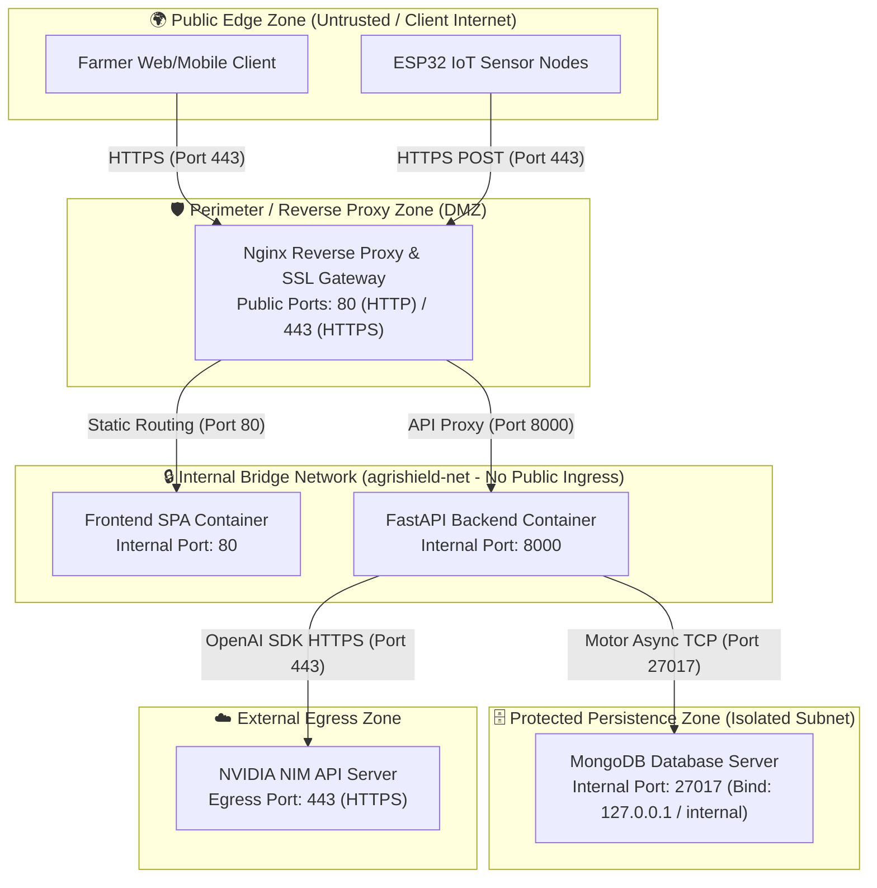
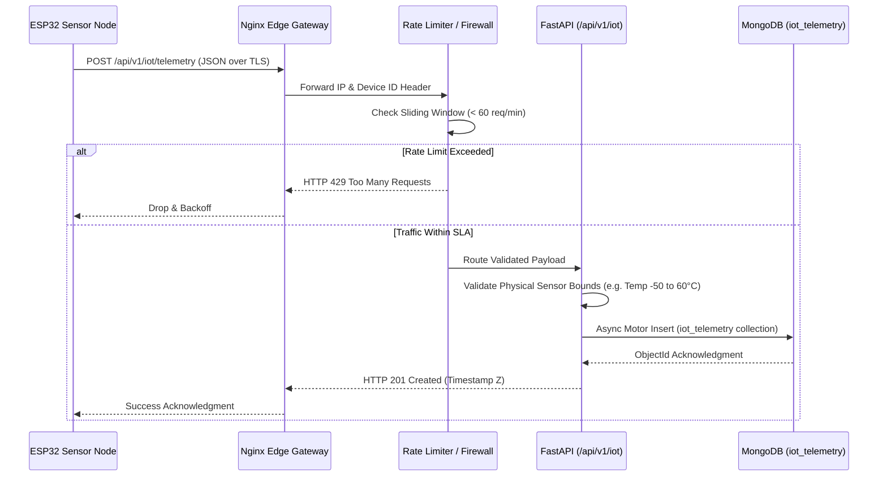

# 🌐 Network Architecture & Security Perimeter – Agri Shield

## 1. Executive Summary

The **AI Crop Disease Detection System (Agri Shield)** implements a defense-in-depth network architecture that isolates backend data processing and database storage from direct public internet exposure. Traffic is governed through defined security zones, strict Cross-Origin Resource Sharing (CORS) whitelisting, firewall ingress boundaries, and encrypted Transport Layer Security (TLS) channels.

This document formalizes the **Network Architecture**, specifying subnet separation, port matrices, CORS enforcement rules, IoT telemetry ingestion protocols, and real-time WebSocket communication channels as implemented in `backend/app/main.py` and `backend/app/services/websocket_manager.py`.

---

## 2. Network Topology & Security Zones

The network architecture separates communications into three distinct security zones: the **Public Edge Zone**, the **Internal Docker Bridge Network (`agrishield-net`)**, and the **Protected Data Tier**.

---

## 3. Port Mapping Matrix & Ingress/Egress Boundaries

To prevent unauthorized network intrusion, external firewall rules MUST drop all inbound packets directed at internal application and database ports. Public ingress is strictly restricted to Nginx on ports `80` and `443`.

| Service / Component | Public Ingress Port | Internal Container Port | Protocol / Transport | Network Exposure | Security Controls / Firewall Rule |
| :--- | :---: | :---: | :---: | :--- | :--- |
| **Nginx Reverse Proxy** | `80`, `443` | `80`, `443` | HTTP/1.1, HTTP/2, TLS | **Public (Internet)** | Rate limiting, SSL termination, HSTS injection |
| **React Frontend SPA** | *None (Blocked)* | `80` (Nginx static) | HTTP/1.1 | **Internal (`agrishield-net`)** | Accessible only via Nginx reverse proxy routing |
| **Vite Dev Server (Local)**| `3000` or `5173` | `3000` or `5173` | HTTP/1.1 | **Localhost Only** | Development tier only; blocked in production |
| **FastAPI Backend Server**| *None (Blocked)* | `8000` | HTTP/1.1, WS | **Internal (`agrishield-net`)** | Accessible only via Nginx `/api/*` and `/ws/*` proxy |
| **MongoDB Community** | *None (Blocked)* | `27017` | TCP (Motor/BSON) | **Isolated Data Zone** | Bound strictly to `127.0.0.1` / docker bridge; external DROP |
| **NVIDIA NIM API** | *None (Egress Only)*| *N/A* | HTTPS (TLS 1.3) | **External Outbound** | Outbound TCP 443 permitted from Backend container only |

---

## 4. CORS Whitelisting & Middleware Defense

Cross-Origin Resource Sharing (CORS) is explicitly regulated within `backend/app/main.py` via FastAPI's `CORSMiddleware` and `SecurityHeadersMiddleware`.

### 4.1 Environment-Aware Origin Enforcement
* **Production Mode (`ENV=production`):** The backend dynamically parses allowed client origins from the `ALLOWED_ORIGINS` environment variable (e.g., `https://agrishield.farm,https://admin.agrishield.farm`). Wildcard origins (`*`) are strictly prohibited in production when credentials are enabled.
* **Development Mode (`ENV=development`):** Origins default to a localized whitelist supporting local frontend dev servers:
  * `http://localhost:3000` / `http://127.0.0.1:3000`
  * `http://localhost:5173` / `http://127.0.0.1:5173`
  * `http://localhost:8000` / `http://127.0.0.1:8000`
  * `http://localhost` / `http://127.0.0.1`

### 4.2 Allowed Methods & Headers
* **Allowed HTTP Methods:** `GET`, `POST`, `PUT`, `DELETE`, `OPTIONS`. (Trace and connect methods are rejected).
* **Allowed Headers:** Wildcard `*` (permitting `Authorization`, `Content-Type`, `X-Requested-With`, and custom IoT headers).
* **Credentials:** `allow_credentials=True` is enforced to support authenticated JWT cookies and Bearer tokens.

---

## 5. IoT Sensor Telemetry Ingestion Protocols

Field-deployed ESP32 microcontrollers communicate with the backend over standardized HTTP/1.1 REST protocols over TLS.

---

## 6. Real-Time WebSocket Channels

To deliver instantaneous disease outbreak alerts and live IoT telemetry updates without long-polling overhead, the system implements asynchronous WebSockets via `backend/app/services/websocket_manager.py`.

### 6.1 WebSocket Channel Specifications
* **Notification Stream (`/ws/notifications`):** Broadcasts real-time agronomic alerts, severe weather warnings, and auto-notification engine triggers to active farmer dashboard sessions.
* **Device Status Stream (`/ws/device-status`):** Streams live heartbeat pings, battery voltage degradation alerts, and online/offline transition events to administrator consoles.
* **Connection Resilience:** The WebSocket manager maintains an active in-memory pool of authenticated client sockets. If a client disconnects due to network instability, the server automatically purges the dead socket handle and gracefully resumes delivery upon reconnection without crashing the ASGI event loop.

---

## 7. Cross-References & Alignment

This Network Architecture directly aligns with:
* **System Deployment Topology:** [Overall Project Information/Deployment_Architecture.md](file:///c:/AI%20Crop%20Disease%20Detection%20System/Overall%20Project%20Information/Deployment_Architecture.md)
* **API Specifications & CORS Setup:** [Overall Project Information/API_Specifications.md](file:///c:/AI%20Crop%20Disease%20Detection%20System/Overall%20Project%20Information/API_Specifications.md)
* **Backend Core Configuration:** [backend/app/main.py](file:///c:/AI%20Crop%20Disease%20Detection%20System/backend/app/main.py)
* **Rate Limiting Engine:** [backend/app/core/rate_limiter.py](file:///c:/AI%20Crop%20Disease%20Detection%20System/backend/app/core/rate_limiter.py)
* **IoT Hardware Firmware Flow:** [Overall Project Information/ESP32_Firmware.md](file:///c:/AI%20Crop%20Disease%20Detection%20System/Overall%20Project%20Information/ESP32_Firmware.md)
