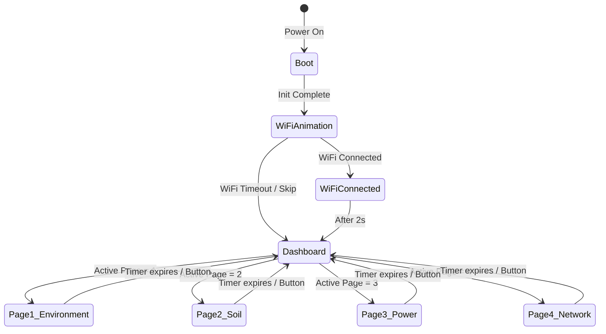

# 🖥️ OLED UI Design – Agri Shield Display System

## Overview

The Agri Shield hardware node features a **SH1106 1.3" monochrome OLED display (128×64 pixels)** that renders a multi-page dashboard interface without any touchscreen. The UI is designed to work at **10 frames per second** using a non-blocking rendering loop.

The display shows real-time sensor readings, WiFi status, battery level, time, and system health. Pages automatically cycle or respond to a button (planned) to navigate.

---

## Display Hardware Specification

| Parameter | Value |
|-----------|-------|
| Driver IC | SH1106 (also compatible with SSD1306 at same I2C address) |
| Size | 1.3 inches diagonal |
| Resolution | 128 × 64 pixels |
| Colors | Monochrome (black and white) |
| I2C Address | 0x3C |
| Library | Adafruit SSD1306 + Adafruit GFX |
| Refresh Rate | 10 FPS (100ms per frame) |
| Rendering | Non-blocking loop (`DisplayManager::update()`) |

---

## UI State Machine



---

## Screen Pages

### Page 0 – Boot Screen
Displayed for **1.5 seconds** after power-on, before WiFi connection begins.

```
┌─────────────────────────────┐
│                             │
│  ░░░░ AGRI SHIELD ░░░░      │
│                             │
│  AI Crop Disease System     │
│                             │
│  Initializing...            │
│                             │
└─────────────────────────────┘
```

**Content:**
- Project name: "AGRI SHIELD"
- Subtitle: "AI Crop Disease System"
- Status: "Initializing..."
- Logo/icon (if custom graphic defined in `GraphicsManager`)

---

### Page 1 – WiFi Connection Animation
Displayed **while the ESP32 is connecting to WiFi**.

```
┌─────────────────────────────┐
│  Connecting to WiFi...      │
│                             │
│      [   ...   ]            │
│   Scanning: MyWiFi          │
│   Signal: ████░░ -55dBm     │
│                             │
└─────────────────────────────┘
```

**Content:**
- SSID being connected to
- Animated dots (frame-based animation)
- RSSI strength bar
- Retry count

---

### Page 2 – WiFi Connected Popup
Displayed for **2 seconds** after successful connection.

```
┌─────────────────────────────┐
│  ✓ WiFi Connected!          │
│                             │
│  SSID: MyFarmNetwork        │
│  IP:   192.168.1.105        │
│  RSSI: -48 dBm              │
│                             │
└─────────────────────────────┘
```

**Content:**
- SSID of connected network
- IP address assigned
- RSSI strength

---

### Page 3 – Dashboard (Environment)
Primary display page showing temperature, humidity, and light.

```
┌─────────────────────────────┐
│ 🌡 Agri Shield   12:34      │
├─────────────────────────────┤
│ Temp:    28.5°C   🌡️         │
│ Humidity: 64.2%  💧         │
│ Light:  8542 lx  ☀️          │
├─────────────────────────────┤
│ ████████████░░  85%  [USB]  │
└─────────────────────────────┘
```

**Layout:**
- **Header bar**: App name + NTP time
- **Row 1**: Temperature (°C) with icon
- **Row 2**: Humidity (%) with icon
- **Row 3**: Light intensity (Lux) with icon
- **Footer bar**: Battery percentage + charging indicator

---

### Page 4 – Soil & Rain Status
Shows soil moisture and rain detection.

```
┌─────────────────────────────┐
│ 🌱 Soil Monitor   12:35     │
├─────────────────────────────┤
│ Soil Moisture: 42%          │
│ [████████░░░░░░] DRY        │
│                             │
│ Rain Status:  NO RAIN 🌤️    │
│                             │
└─────────────────────────────┘
```

**Layout:**
- **Header**: Section title + time
- **Soil row**: Numeric percentage + visual bar + status label
- **Rain row**: Rain detected or not with icon

**Soil Status Labels:**

| Range | Label |
|-------|-------|
| 0–25% | VERY DRY |
| 25–50% | DRY |
| 50–70% | OPTIMAL |
| 70–85% | MOIST |
| 85–100% | WET |

---

### Page 5 – Battery & Power Status
Displays battery level, voltage, and charging state.

```
┌─────────────────────────────┐
│ 🔋 Power Status   12:36     │
├─────────────────────────────┤
│ Battery: ████████░░  78%    │
│ Voltage: 3.96V              │
│ Status:  Discharging        │
│                             │
│ Uptime:  02:15:33           │
└─────────────────────────────┘
```

**Layout:**
- Battery bar (8-segment visual)
- Voltage reading from ADC
- Charging status (Charging/Discharging/Full)
- System uptime since boot

---

### Page 6 – Network & Backend Status
Displays WiFi connectivity and backend API status.

```
┌─────────────────────────────┐
│ 📡 Network Status  12:37   │
├─────────────────────────────┤
│ WiFi:    CONNECTED          │
│ SSID:    MyFarmNetwork      │
│ RSSI:    -52 dBm ████░      │
│ Backend: ONLINE ✓           │
│ SD Card: MOUNTED            │
└─────────────────────────────┘
```

---

## Page Cycling

Pages automatically rotate every **5 seconds** in the production firmware. In the OLED hardware test mode (`HARDWARE_TEST_OLED`), pages rotate every **3 seconds**.

```cpp
// Production loop (from main.cpp)
if (currentMillis - lastDisplayUpdate >= 100) {
    DisplayManager::update();  // Called at 10 FPS
}
```

The `DisplayManager::update()` internally handles which page to render based on `SystemData::getSystem().activePage`.

---

## Icon System

All icons are **8×8 or 16×16 pixel bitmap arrays** defined in the `GraphicsManager` library:

| Icon | Bitmap Size | Usage |
|------|------------|-------|
| Temperature | 8×8 | Temp reading |
| Droplet | 8×8 | Humidity reading |
| Sun | 8×8 | Light intensity |
| Plant | 8×8 | Soil moisture |
| Battery | 16×8 | Battery level |
| WiFi | 16×8 | Connection status |
| Cloud/Rain | 8×8 | Rain detection |
| SD Card | 8×8 | Storage status |

Icons are rendered using the Adafruit GFX `drawBitmap()` function.

---

## Display Manager Library Structure

```
lib/DisplayManager/
├── DisplayManager.h      # Class declaration
├── DisplayManager.cpp    # Rendering logic + page selection
└── pages/
    ├── BootPage.cpp      # Boot screen renderer
    ├── DashboardPage.cpp # Main environment page
    ├── SoilPage.cpp      # Soil + rain page
    ├── PowerPage.cpp     # Battery + power page
    └── NetworkPage.cpp   # WiFi + backend status
```

---

## OLED UI Data Flow

```mermaid
sequenceDiagram
    participant Loop as main.cpp loop()
    participant DM as DisplayManager
    participant SD as SystemData
    participant OLED as SH1106 OLED

    Loop->>DM: update() every 100ms
    DM->>SD: getSystem().activePage
    DM->>SD: getSensors()
    DM->>SD: getNetwork()
    DM->>DM: Select page renderer
    DM->>OLED: clearDisplay()
    DM->>OLED: drawBitmap() icons
    DM->>OLED: print() text values
    DM->>OLED: display() (flush buffer)
```

---

## SystemData Structure for Display

The `SystemData` singleton holds all live data shared across managers:

```cpp
struct SD_Sensors {
    float temperature;
    bool  temperatureValid;
    float humidity;
    float soilMoisture;
    bool  soilValid;
    float lightIntensity;
    bool  lightValid;
    int   batteryPercentage;
    bool  batteryValid;
    bool  batteryCharging;
};

struct SD_Network {
    bool   wifiConnected;
    bool   backendOnline;
    int    wifiRSSI;
    char   currentTime[6];    // "HH:MM"
    char   ssid[32];
    char   ipAddress[16];
};

struct SD_System {
    int    activePage;         // 1–4 (display page index)
    int    uptimeSeconds;
    String firmwareVersion;
    bool   sdMounted;
};
```
