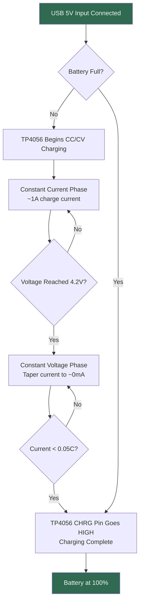

# 🔋 Power Management – Agri Shield

## Overview

The Agri Shield hardware uses a **self-contained rechargeable power system** built around a single 18650 Li-Ion cell. The system includes a dedicated charging module (TP4056), a boost voltage converter (MT3608), and battery level monitoring through an analog voltage divider connected to the ESP32 ADC.

---

## Power System Components

| Component | Model | Role |
|-----------|-------|------|
| Battery | 18650 Li-Ion (3.7V, 2200–3500mAh) | Primary energy storage |
| Charger | TP4056 with DW01A protection IC | Battery charging + protection |
| Boost Converter | MT3608 | Steps up 3.7V → 5V for ESP32 |
| Voltage Divider | 2× 100kΩ resistors | Battery voltage sensing |
| Power Switch | SPST slide or push switch | On/Off control |

---

## Battery Charging Flow



---

## TP4056 Charging Module – Detailed Operation

### Overview
The TP4056 is a complete constant-current/constant-voltage linear charger IC for single-cell lithium-ion batteries. The module available in the market typically integrates the TP4056 charging IC and the DW01A protection IC with dual MOSFET switches.

### Charging Phases

| Phase | Description | Condition |
|-------|-------------|-----------|
| Trickle Charge | Pre-charges deeply discharged cells | V_bat < 3.0V |
| Constant Current (CC) | Charges at preset current (1A max) | 3.0V < V_bat < 4.2V |
| Constant Voltage (CV) | Holds 4.2V, tapers current | V_bat = 4.2V |
| Charge Complete | No more current flow | I_bat < C/10 |

### TP4056 Pin Functions

| Pin | Name | Function |
|-----|------|---------|
| IN+ | Input Positive | Connected to USB 5V |
| IN- | Input Negative | Connected to GND |
| B+ | Battery Positive | Connected to 18650 (+) |
| B- | Battery Negative | Connected to 18650 (-) |
| CHRG | Charge Status | LOW when charging, HIGH when done |
| STDBY | Standby Status | LOW when in standby/done |

> [!IMPORTANT]
> The **CHRG pin** is connected to **GPIO 4** of the ESP32. The firmware reads this pin to determine if the battery is currently charging (LOW = charging, HIGH = full/no charger).

### Built-in Battery Protection (DW01A)

The modules sold in the market combine the TP4056 with the DW01A protection IC which provides:

| Protection | Trigger Voltage | Description |
|-----------|----------------|-------------|
| Overcharge Protection | 4.25V ± 0.025V | Disconnects charger |
| Over-discharge Protection | 2.4V ± 0.05V | Disconnects load |
| Overcurrent Protection | ~3–4A | Disconnects load |
| Short Circuit Protection | Instantaneous | Disconnects load |

---

## MT3608 Boost Converter – Operation

### Overview
The MT3608 is a high-efficiency, step-up (boost) converter that raises the battery voltage (3.7–4.2V) to a stable 5V output to power the ESP32 VIN pin. Without this, the ESP32 would not function when the battery is at 3.7V since it requires 5V on VIN (internally regulated to 3.3V).

### Specifications

| Parameter | Value |
|-----------|-------|
| Input Voltage | 2.0V – 24V |
| Output Voltage | Adjustable via trimmer (set to 5.0V) |
| Max Output Current | 2A |
| Efficiency | Up to 93% |
| Switching Frequency | 1.2MHz |
| Operating Temperature | -40°C to +85°C |

### Voltage Setting
The output voltage is adjusted using the onboard trimmer potentiometer:
```
V_out = V_ref × (1 + R1/R2)
Target: V_out = 5.0V exactly
Adjust trimmer until multimeter reads 5.00V on OUT pin (with no load)
```

> [!WARNING]
> Set MT3608 output to exactly 5.0V before connecting to ESP32. Too high a voltage will damage the ESP32.

---

## Battery Voltage Monitoring

### Voltage Divider Circuit

The battery voltage is measured by the ESP32's ADC through a voltage divider:

```
Battery (+) ─── R1 (100kΩ) ─── GPIO 36 (ADC Input)
                              │
                           R2 (100kΩ)
                              │
                            GND
```

Since the ESP32 ADC maximum input is 3.3V and the battery can be up to 4.2V, the voltage divider scales the battery voltage by a factor of 0.5.

### Voltage Calculation Formula

```
ADC Raw = 0 to 4095 (12-bit, Vref = 3.3V)
V_measured = ADC_raw × (3.3V / 4095)
V_battery = V_measured × 2       // × 2 because R1=R2

Battery Percentage:
  VMIN = 3.0V  (0% charge – safe cutoff)
  VMAX = 4.2V  (100% charge – fully charged)
  pct = ((V_battery - VMIN) / (VMAX - VMIN)) × 100
  pct = clamp(pct, 0, 100)
```

### Battery Level Reference Table

| Battery % | Voltage | Status |
|-----------|---------|--------|
| 100% | 4.20V | Full |
| 80% | 4.00V | Good |
| 60% | 3.85V | Normal |
| 40% | 3.70V | Low |
| 20% | 3.55V | Very Low |
| 0% | 3.00V | Critically Low – shutdown recommended |

---

## Power Consumption Estimates

| Component | Current Draw (approx) | Notes |
|-----------|----------------------|-------|
| ESP32 (active WiFi) | 80–160mA | During telemetry upload |
| ESP32 (idle) | 10–20mA | Between uploads |
| ESP32 (deep sleep) | 10µA | Not implemented in Phase 1 |
| AHT10 | 0.023mA | Measurement active |
| BH1750 | 0.12mA | Measurement active |
| Soil Sensor | 5mA | Always on when powered |
| Rain Sensor | 1mA | Always on when powered |
| SH1106 OLED | 5–20mA | Display on |
| SD Card | 10–100mA | During write |
| **Total (avg active)** | **~150–200mA** | During active WiFi + display |

### Estimated Battery Life

Using a 3000mAh 18650 cell:
```
Battery life ≈ Capacity / Average current
             ≈ 3000mAh / 180mA
             ≈ ~16 hours continuous operation

With 5-minute telemetry interval (ESP32 light sleep between readings):
             ≈ ~30-36 hours (estimated)
```

> [!NOTE]
> Deep sleep mode (Phase 2 target) would extend battery life to 3–5 days.

---

## Safety Precautions

> [!CAUTION]
> **NEVER short-circuit a Li-Ion battery.** This can cause fire, explosion, or severe burns.

1. **Always use the DW01A-protected TP4056 module** – never connect a raw Li-Ion battery without protection.
2. **Do not discharge below 2.8V** – this permanently damages the cell.
3. **Do not overcharge above 4.2V** – the TP4056 prevents this automatically.
4. **Store batteries at 50% charge** if not using for long periods.
5. **Inspect batteries regularly** – dispose of any swollen or leaking cells immediately.
6. **Do not expose to temperatures above 60°C**.

---

## Power Flow Summary

```
USB 5V → TP4056 (CC/CV Charger) → 18650 Battery → MT3608 (5V Boost) → Power Switch → ESP32 VIN
                                         ↑
                                   CHRG Pin → GPIO 4 (ESP32 reads charging status)
                                         ↑
                                Voltage Divider → GPIO 36 (ESP32 reads battery %)
```
