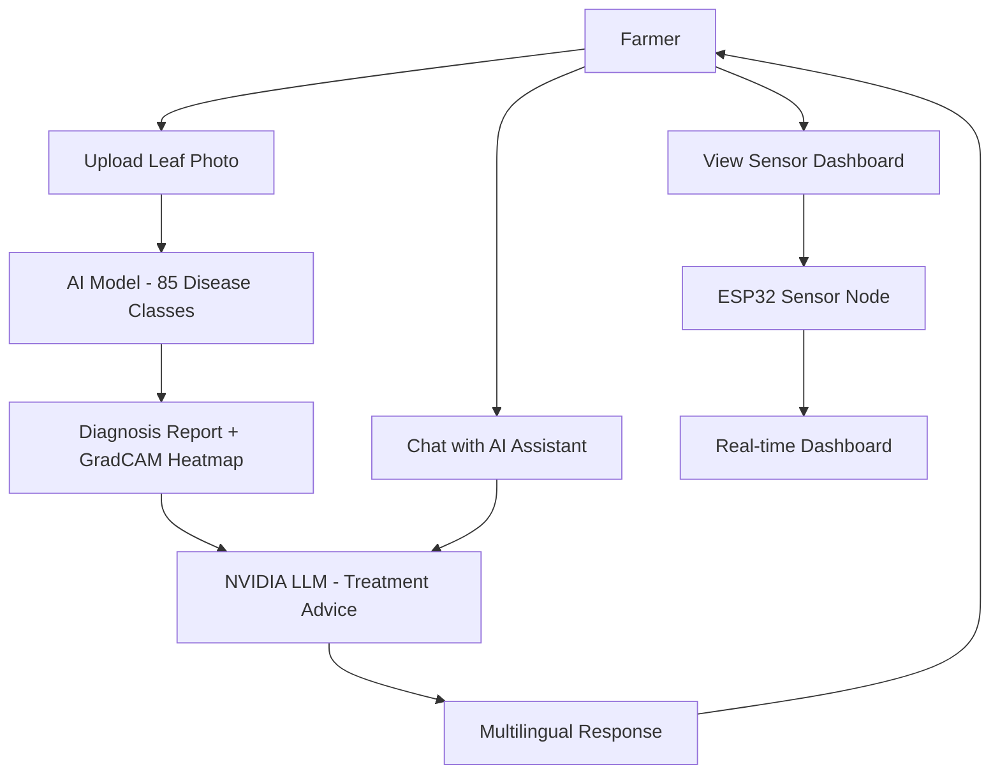

# 📖 Project Overview – Agri Shield

## Project Title

**Agri Shield – AI-Based Crop Disease Detection System**

> An intelligent agricultural diagnostic platform that integrates IoT hardware, computer vision AI, and a conversational farming assistant to help farmers detect, understand, and treat crop diseases efficiently.

---

## Abstract

Agri Shield is a Final Year Engineering Project that demonstrates the integration of modern IoT, deep learning AI, and full-stack web development for solving a real-world agricultural problem. The system uses an ESP32 microcontroller to collect real-time environmental sensor data (temperature, humidity, soil moisture, light, rain), a custom-trained MobileNetV3 deep learning model with Knowledge Distillation to detect 85 different crop disease classes from leaf images, and a cloud-based AI chatbot (NVIDIA NIM – Llama 3.1 8B) to generate personalized agronomic advice in the farmer's native language.

---

## Problem Statement

### The Agricultural Crisis
- India loses approximately **₹1.8 lakh crore** annually due to crop diseases.
- Small and marginal farmers (who own < 2 hectares) represent over **85% of Indian farmers**.
- Most farmers lack access to agricultural experts and rely on traditional methods for disease identification.
- Early detection of crop diseases can increase yield by **30–40%**.
- Manual identification of crop diseases requires expert knowledge and is time-consuming.

### The Technology Gap
- Existing solutions are either too expensive for rural farmers or require internet connectivity.
- AI models deployed in agriculture are often general-purpose and not trained on Indian crop varieties.
- There is no unified system that combines real-time environmental monitoring, AI disease detection, and actionable advice in a single platform.

---

## Existing System

| Feature | Existing Apps/Tools |
|---------|---------------------|
| Disease Detection | PlantVillage (basic), PlantDoc (limited classes) |
| Sensor Monitoring | Separate expensive IoT platforms |
| AI Advice | Generic chatbots, not farming-specific |
| Language Support | English-only in most tools |
| Offline Support | None in most web-based tools |
| Cost | High (₹10,000–₹50,000 for commercial units) |

---

## Proposed System – Agri Shield

Agri Shield integrates all components into one affordable, open-source platform:

---

## Objectives

1. **Early Disease Detection**: Identify crop diseases from leaf images with >85% accuracy.
2. **Real-time Monitoring**: Continuously monitor temperature, humidity, soil moisture, light, and rain.
3. **Intelligent Advice**: Provide crop-specific treatment and prevention recommendations using LLM AI.
4. **Multilingual Interface**: Support 6 Indian languages for rural accessibility.
5. **Offline Resilience**: Cache sensor data on SD card during network outages.
6. **Explainable AI**: Use GradCAM++ to visually highlight diseased leaf regions.
7. **Low-cost Hardware**: Build on affordable ESP32 (<₹500) with common sensors.

---

## Key Features

### Hardware Features
| Feature | Component | Status |
|---------|-----------|--------|
| Temperature & Humidity | AHT10 Sensor | ✅ Implemented |
| Light Intensity | BH1750 Sensor | ✅ Implemented |
| Soil Moisture | Capacitive Sensor v1.2 | ✅ Implemented |
| Rain Detection | Analog Rain Sensor | ✅ Implemented |
| OLED Display | SH1106 1.3" 128×64 | ✅ Implemented |
| Local Logging | MicroSD Card Module | ✅ Implemented |
| Battery System | 18650 + TP4056 + MT3608 | ✅ Implemented |
| WiFi Connectivity | ESP32 Built-in 802.11b/g/n | ✅ Implemented |
| OTA Updates | ESP32 OTA Module | 🔄 Planned |

### Software Features
| Feature | Technology | Status |
|---------|-----------|--------|
| Disease Detection AI | MobileNetV3 KD | 🔄 Training |
| AI Chatbot | NVIDIA NIM – Llama 3.1 | ✅ Implemented |
| Web Dashboard | React 18 + Tailwind | ✅ Implemented |
| REST API | FastAPI + MongoDB | ✅ Implemented |
| JWT Authentication | bcrypt + python-jose | ✅ Implemented |
| Multi-language | i18next (6 languages) | ✅ Implemented |
| Image Upload | FastAPI multipart | ✅ Implemented |
| GradCAM++ Explainer | OpenCV + TF | ✅ Implemented |
| PDF Reports | jsPDF | ✅ Implemented |
| Prediction History | MongoDB | ✅ Implemented |
| Analytics Dashboard | Recharts | ✅ Implemented |
| Device Management | ESP32 + MongoDB | ✅ Implemented |
| IoT Telemetry API | FastAPI + MongoDB | ✅ Implemented |

---

## System Advantages

| Advantage | Description |
|-----------|-------------|
| **Affordable** | ESP32-based hardware costs < ₹1,500 total |
| **Accurate AI** | 85-class detection via Knowledge Distillation |
| **Explainable** | GradCAM++ shows which leaf region caused the diagnosis |
| **Multilingual** | 6 Indian languages supported (EN, HI, TE, TA, KN, ML) |
| **Offline Resilient** | SD card caches data offline, syncs when WiFi returns |
| **Unified Platform** | Sensor monitoring + disease detection + AI advice in one app |
| **Open Source** | All hardware and software is open-source |
| **Local Deployment** | No cloud required – runs entirely on a local network |

---

## Limitations

| Limitation | Description |
|------------|-------------|
| **CPU-only Training** | Model training runs on CPU (no GPU), making it slow |
| **Dataset** | PlantVillage dataset may not cover all Indian crop diseases |
| **No GPS** | No location-based field mapping in Phase 1 |
| **No Push Notifications** | Notification system not yet implemented |
| **Single Device** | Phase 1 supports a single ESP32 node per account |
| **LLM Dependency** | Chatbot requires NVIDIA API key and internet for live advice |
| **No PDF Export** | Report download in PDF is present, but export has issues |

---

## Future Scope

1. Multi-device farm monitoring (multiple ESP32 nodes per farm)
2. GPS-tagged prediction locations
3. Weather forecast integration (OpenWeatherMap)
4. Irrigation recommendation based on soil + weather data
5. Fertilizer recommendation engine
6. Crop growth stage monitoring
7. Pest detection (separate model)
8. Disease severity scoring (0–100% severity scale)
9. Push notifications (PWA/SMS alerts)
10. Voice assistant in regional languages
11. Satellite imagery integration
12. Multi-crop support with crop calendar

---

## Conclusion

Agri Shield demonstrates that affordable, intelligent crop disease management is achievable without expensive lab equipment or dedicated agronomists. By combining IoT sensors, AI-powered image analysis, and multilingual LLM-based advice, the system empowers small farmers to make data-driven decisions about their crop health. Phase 1 establishes the full hardware and software foundation. Phase 2 will scale the platform to support multi-farm deployments, advanced AI capabilities, and mobile-first design.
