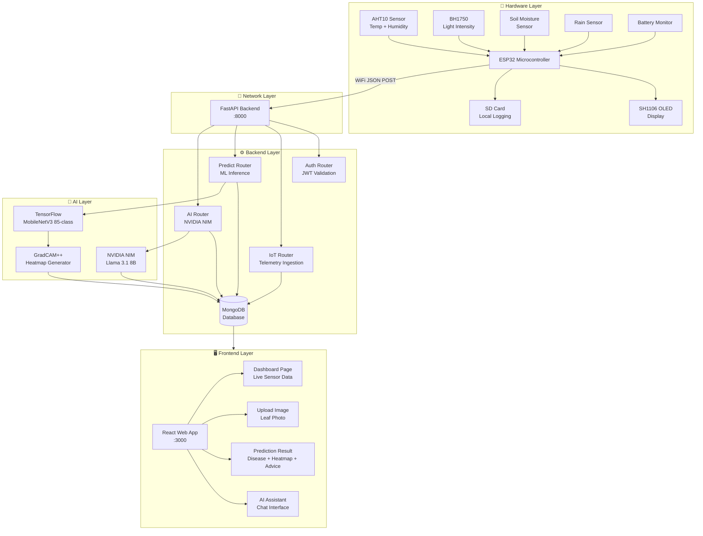
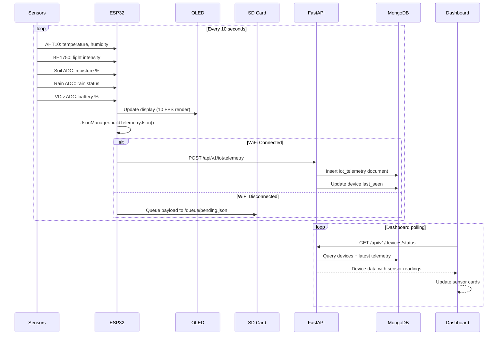
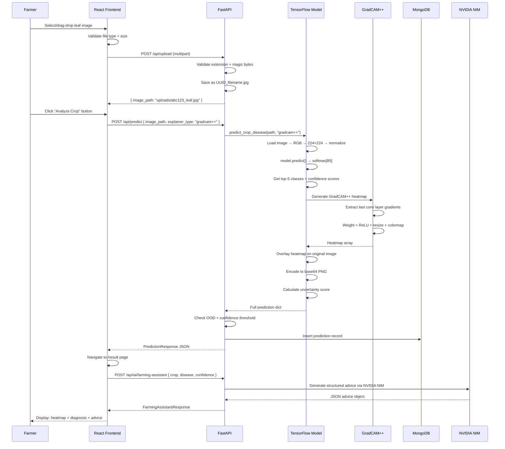
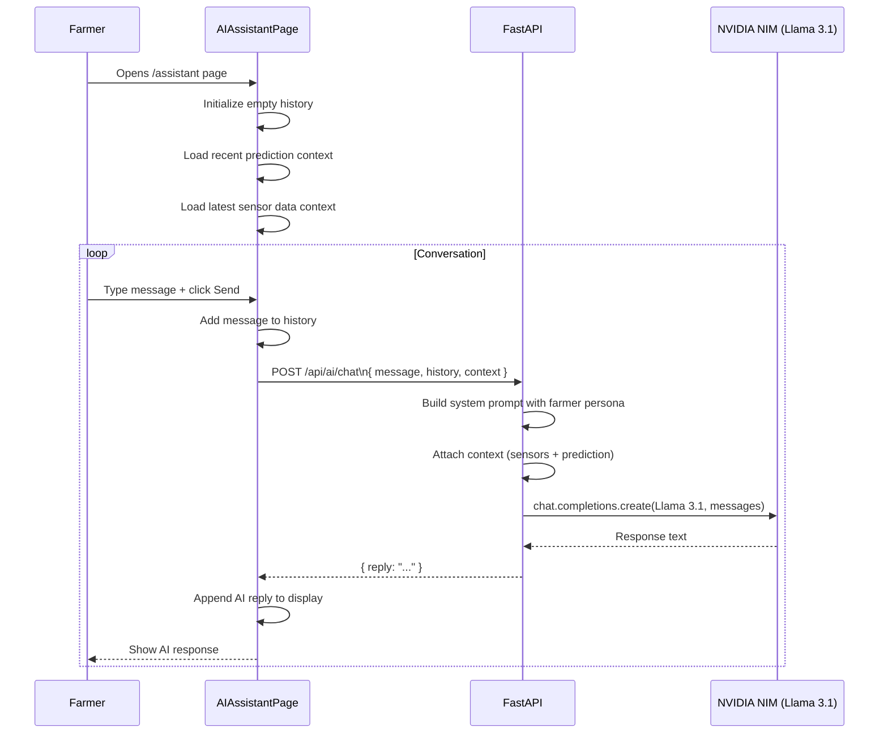
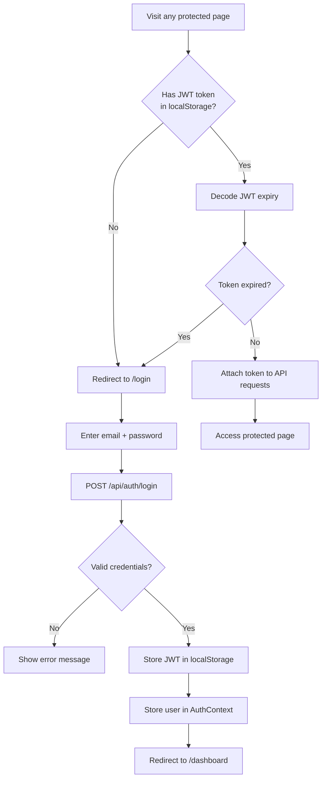
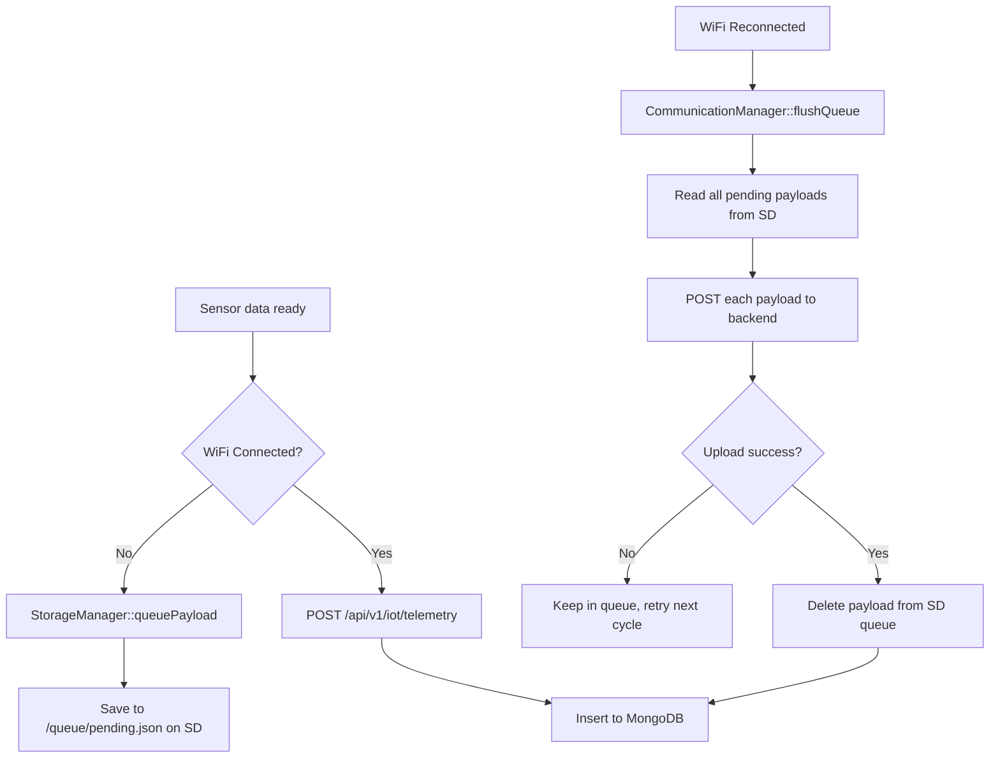
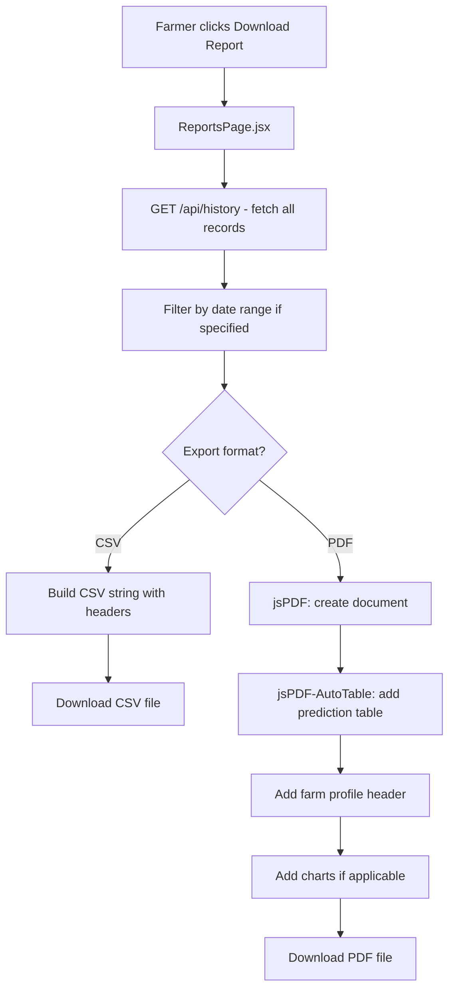

# 🔄 Project Workflow – Agri Shield End-to-End

## Overview

This document describes the complete end-to-end workflow of the Agri Shield system, from physical sensor readings on the ESP32 hardware to AI-powered diagnosis, multilingual advice generation, and dashboard visualization.

---

## Complete System Workflow



---

## Workflow 1: Sensor Data Collection & Display



---

## Workflow 2: Disease Detection



---

## Workflow 3: AI Chatbot Conversation



---

## Workflow 4: User Authentication



---

## Workflow 5: ESP32 WiFi State Machine

```mermaid
stateDiagram-v2
    [*] --> DISCONNECTED: Boot
    DISCONNECTED --> SCANNING: WiFiManager::init()
    SCANNING --> CONNECTING: Known SSID found
    SCANNING --> FAILED: Max scan attempts
    CONNECTING --> CONNECTED: Association success
    CONNECTING --> RECONNECTING: Connection failed
    CONNECTED --> RECONNECTING: WiFi dropped
    RECONNECTING --> CONNECTING: Retry
    RECONNECTING --> FAILED: Max retries exceeded
    FAILED --> SCANNING: Periodic retry (5 min)
    CONNECTED --> CONNECTED: Normal operation
    
    note right of CONNECTED
        - Send telemetry every 10s
        - Send heartbeat every 30s
        - Sync NTP time
        - Flush SD queue
    end note
    
    note right of RECONNECTING
        - Queue telemetry to SD card
        - Display WiFi error on OLED
        - Continue sensor readings
    end note
```

---

## Workflow 6: Offline Data Sync

When WiFi is unavailable, the ESP32 queues data to the SD card and syncs when reconnected:



---

## Workflow 7: Multi-language Report Generation



---

## Complete Data Flow Summary

```
Physical World
    ↓ (sensors detect environment)
ESP32 Hardware (sensors → AHT10, BH1750, soil, rain, battery)
    ↓ (JSON over WiFi every 10 seconds)
FastAPI Backend (POST /api/v1/iot/telemetry)
    ↓ (insert document)
MongoDB (iot_telemetry collection)
    ↓ (GET /api/v1/devices/status polling)
React Dashboard (live sensor cards update)
    ↓ (farmer views dashboard)
Farmer sees: Temp 28.5°C | Humidity 64% | Soil 42% DRY | No Rain

Farmer uploads leaf photo
    ↓ (POST /api/upload → /api/predict)
TensorFlow MobileNetV3 (85-class inference)
    ↓ (GradCAM++ heatmap)
Prediction saved to MongoDB
    ↓ (POST /api/ai/farming-assistant)
NVIDIA NIM Llama 3.1 (generate structured advice)
    ↓
Farmer sees: Disease: Bacterial Spot 93.4% | Heatmap | Treatment plan

Farmer asks follow-up question
    ↓ (POST /api/ai/chat)
NVIDIA NIM with conversation history + sensor context
    ↓
Farmer gets: Personalized farming advice in their language
```
