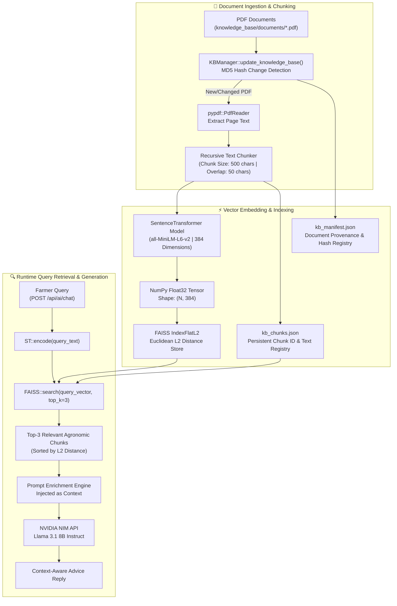

# 🧠 RAG Knowledge Base Architecture – Agri Shield

## 1. Executive Summary

The **AI Crop Disease Detection System** incorporates an advanced **Retrieval-Augmented Generation (RAG)** pipeline to enrich generative agricultural advice with authoritative, domain-specific agronomic literature. Implemented within `backend/app/services/kb_manager.py`, the RAG engine ingests agricultural PDF documents, splits text into recursive overlapping chunks, converts text into 384-dimensional dense vector embeddings using **SentenceTransformers**, and indexes them in a local high-speed **FAISS (Facebook AI Similarity Search)** Euclidean vector database.

When a farmer queries the **AgriBot Chatbot** or requests structured disease treatment plans, relevant knowledge chunks are retrieved in milliseconds and dynamically injected into the system prompt of the **NVIDIA NIM Llama 3.1 8B Instruct** large language model.

---

## 2. RAG Pipeline & Data Flow Architecture

The following Mermaid flowchart maps the end-to-end lifecycle of agricultural documents from ingestion and indexing to query retrieval and LLM context enrichment.



---

## 3. Technical Implementation Specifications

### 3.1 Document Ingestion & Change Detection
* **Service Module:** `backend/app/services/kb_manager.py` (`KBManager` class).
* **Storage Path:** All authoritative agricultural manuals and research papers are stored as `.pdf` files in `knowledge_base/documents/` (relative to backend workspace root).
* **Incremental Synchronization:** When `update_knowledge_base()` is triggered, the system reads `knowledge_base/kb_manifest.json` and calculates a 64KB-block MD5 hash (`_get_file_hash()`) for every PDF in the directory. Vector re-indexing occurs only if a file addition, deletion, or content modification is detected, preventing redundant CPU/GPU embedding overhead.

### 3.2 Recursive Text Chunking
To ensure semantic continuity and prevent context fragmentation across page boundaries, extracted text is processed through a recursive sliding-window chunker:
* **Chunk Size:** `500` characters per chunk.
* **Chunk Overlap:** `50` characters between consecutive chunks (10% overlap).
* **Provenance Tracking:** Each generated chunk is assigned a sequential integer ID, tagged with its source PDF filename (`doc_name`), and persisted to `knowledge_base/kb_chunks.json`.

### 3.3 Embedding Model & FAISS Vector Store
* **Embedding Model:** `all-MiniLM-L6-v2` (loaded via `sentence-transformers` library).
  * **Vector Dimensionality:** `384` continuous floating-point dimensions.
  * **Optimization:** Vectors are cast to `numpy.float32` arrays for hardware-accelerated similarity computation.
* **Vector Database:** **FAISS (IndexFlatL2)**.
  * **Index Type:** Exact Euclidean (L2) distance search (`faiss.IndexFlatL2(384)`).
  * **Persistence:** The compiled binary index is serialized to disk at `knowledge_base/vector_store.faiss` via `faiss.write_index()`.

### 3.4 Runtime Retrieval Mechanics
When an inference request invokes `query_knowledge_base(query_text, top_k=3)`:
1. The input query string is vectorized into a `384`-dimensional `float32` tensor.
2. `faiss_index.search()` executes an L2 distance nearest-neighbor lookup across the index.
3. The top `k=3` matching chunk IDs are mapped back to text payloads in `self.chunks_data`.
4. A structured dictionary containing `doc_name`, `text`, and Euclidean `distance` score is returned to the AI router.

---

## 4. File Provenance & Manifest Schema

### 4.1 `kb_manifest.json` Structure
The manifest maintains an immutable registry of ingested agricultural knowledge:
```json
{
  "manifest_version": "1.0",
  "last_updated": "2026-07-26T21:47:17.923019Z",
  "documents": {
    "tomato_disease_manual.pdf": {
      "version": 1,
      "file_hash": "a1b2c3d4e5f67890123456789abcdef0",
      "file_size": 1048576,
      "chunk_count": 142,
      "added_at": "2026-07-26T21:47:17.923019Z"
    }
  }
}
```

### 4.2 `kb_chunks.json` Structure
```json
[
  {
    "id": 0,
    "doc_name": "tomato_disease_manual.pdf",
    "text": "Bacterial spot on tomato is caused by Xanthomonas campestris pv. vesicatoria. Symptoms appear as small, water-soaked circular lesions on leaves..."
  }
]
```

---

## 5. Cross-References & Alignment

This RAG architecture integrates directly with existing system components:
* **LLM Chatbot Integration:** [Overall Project Information/AI_Chatbot.md](file:///c:/AI%20Crop%20Disease%20Detection%20System/Overall%20Project%20Information/AI_Chatbot.md)
* **Backend Service Architecture:** [Overall Project Information/Backend_Architecture.md](file:///c:/AI%20Crop%20Disease%20Detection%20System/Overall%20Project%20Information/Backend_Architecture.md)
* **System Overview & AI Pipeline:** [Overall Project Information/Software_Architecture.md](file:///c:/AI%20Crop%20Disease%20Detection%20System/Overall%20Project%20Information/Software_Architecture.md)
* **RAG Implementation Source Code:** [backend/app/services/kb_manager.py](file:///c:/AI%20Crop%20Disease%20Detection%20System/backend/app/services/kb_manager.py)
