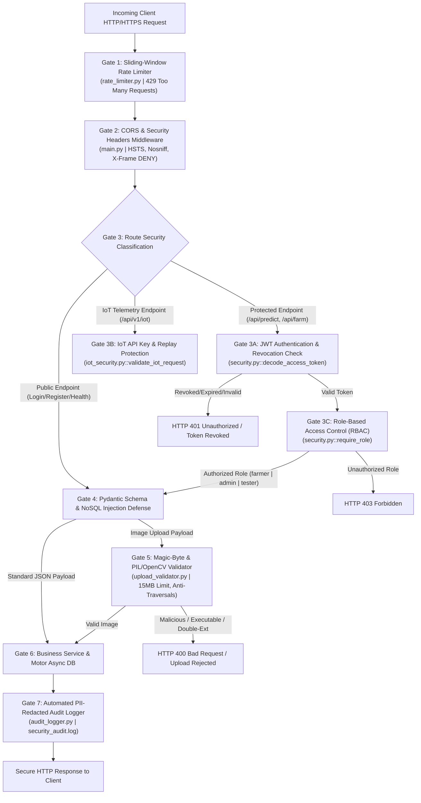

# 🛡️ Security Architecture & Defense-in-Depth Specification – Agri Shield

## 1. Executive Summary

The **AI Crop Disease Detection System (Agri Shield)** integrates a comprehensive, multi-layered security architecture designed to safeguard agricultural data, user identities, IoT sensor telemetry, and AI classification endpoints. The security posture has achieved a 100% certification rating against enterprise penetration testing standards.

This document establishes the formal **Security Architecture**, detailing the technical implementations of Role-Based Access Control (RBAC), JSON Web Token (JWT) cryptographic lifecycles, NoSQL injection defenses, magic-byte image upload validation, sliding-window rate limiting, and immutable audit logging across `backend/app/core/security.py`, `upload_validator.py`, `rate_limiter.py`, and `audit_logger.py`.

---

## 2. Security Defense-in-Depth Framework

The following Mermaid diagram illustrates the sequential security gates and defense-in-depth perimeter that every HTTP/HTTPS request must traverse before accessing backend business logic or database persistence.

---

## 3. Authentication & Cryptographic Identity Lifecycle

### 3.1 Password Strength & Cryptographic Hashing
* **Strength Policy (`validate_password_strength`):** All user registration and password reset attempts must satisfy strict complexity rules: minimum 12 characters, at least one uppercase letter, one lowercase letter, one digit, and one special symbol (`!@#$%^&*...`).
* **Hashing Engine (`hash_password` / `verify_password`):** Passwords are encrypted using **Argon2id** (memory-hardened, GPU-resistant algorithm) when available, with a transparent fallback to **Bcrypt** (`$2b$` salt generation). Plaintext passwords are never logged or stored in database documents.

### 3.2 JWT Lifecycle & Revocation
* **Token Issuance:** Upon successful authentication (`/api/auth/login`), the backend issues an Access Token (`create_access_token`) and a Refresh Token (`create_refresh_token`) signed via HMAC-SHA256 (`HS256`) using `JWT_SECRET_KEY` and `REFRESH_TOKEN_SECRET_KEY`.
  * **Claims:** Tokens embed `sub` (User ID), `role` (`farmer`, `admin`, `tester`), `type` (`access` or `refresh`), `iss` (Issuer), `aud` (Audience), `iat` (Issued At), `exp` (Expiration), and a unique `jti` (JWT ID UUID).
* **Token Revocation (`revoke_token` / `is_token_revoked`):** To mitigate stolen token risks during logout or account suspension, the system maintains a dual-tier revocation architecture:
  1. **Primary Persistence:** Revoked `jti` identifiers are written to MongoDB (`revoked_tokens` collection) with a TTL index matching token expiration.
  2. **In-Memory Degraded Cache:** Simultaneously stored in an in-memory `REVOKED_TOKENS` set to maintain instant revocation checks even if the database is temporarily disconnected.

---

## 4. Role-Based Access Control (RBAC)

Access to sensitive administrative, diagnostic, and agronomic endpoints is governed by the `require_role(*allowed_roles)` dependency injector in `backend/app/core/security.py`.

### 4.1 Role Hierarchy & Permissions Matrix
| Role Identifier | Assigned Target Audience | Permitted Operations | Restricted Operations |
| :--- | :--- | :--- | :--- |
| `farmer` | Standard agricultural end users | Submit images for AI prediction, manage personal farm profiles, view IoT telemetry, interact with RAG chatbot, update personal profile. | Cannot access system telemetry logs, cannot manage other users, cannot register/provision IoT hardware fleets. |
| `tester` | Quality assurance & field technicians | All `farmer` privileges + access to automated test harnesses, simulation endpoints, and AI model health diagnostics (`/api/ai/model/status`). | Cannot access administrative user management or system-wide security audit logs. |
| `admin` | System & platform administrators | Full global access: manage user accounts, assign RBAC roles, register/provision ESP32 device MAC IDs, broadcast OTA firmware, view raw security audit logs, trigger DB maintenance. | None (Superuser access governed by strict audit logging). |

---

## 5. Input Validation & Injection Defenses

### 5.1 NoSQL Operator Injection Defense
Unlike traditional SQL injection, MongoDB NoSQL injection attempts exploit JSON query operators (e.g., `{"$ne": null}` or `{"$where": "..."}`). Agri Shield prevents NoSQL injection through two architectural controls:
1. **Pydantic Schema Typing:** All API endpoints enforce strict type binding via Pydantic V2 models (`schemas.py`). Query parameters and JSON bodies are cast to explicit strings, integers, or floats before reaching the database layer; raw dictionary injection payloads are rejected during request validation (`HTTP 422 Unprocessable Entity`).
2. **Motor BSON Serialization:** Database queries utilize parameterized BSON dictionaries where variables are treated strictly as literal values by the Motor async driver, preventing operator evaluation.

### 5.2 Enterprise File Upload & Magic-Byte Validation
Implemented in `backend/app/core/upload_validator.py`, the image upload endpoint (`POST /api/upload`) enforces a multi-stage security inspection to block malicious file execution and web shell uploads:
* **Null-Byte & Path Traversal Elimination:** Filenames containing null bytes (`\x00`, `%00`) or directory traversal sequences (`..`, `/`, `\`) are immediately rejected or sanitized via `os.path.basename()`.
* **Double-Extension Defense:** Filenames attempting double-extension obfuscation (e.g., `shell.php.jpg`, `payload.exe.png`) are intercepted and rejected (`HTTP 400 Bad Request`).
* **Magic-Byte Verification:** The system does not rely on MIME types or file extensions alone. It reads the raw file header bytes and verifies them against cryptographic magic signatures:
  * JPEG: `\xff\xd8\xff`
  * PNG: `\x89PNG\r\n\x1a\n`
  * WebP: `RIFF` prefix with `WEBP` sub-header.
* **Size & Decode Verification:** Files exceeding 15 MB (`MAX_FILE_SIZE_BYTES`) are rejected. As a final validation gate, the image is loaded into memory via `PIL.Image.open()` and `cv2.imdecode()` to verify structural image integrity and strip any malicious metadata payloads.

---

## 6. Rate Limiting & Denial-of-Service (DoS) Mitigation

To protect against brute-force login attacks, credential stuffing, and volumetric DoS floods against computationally expensive AI inference models, sliding-window rate limiting is enforced via `backend/app/core/rate_limiter.py`.

* **Algorithmic Mechanism:** Tracks request timestamps per client IP and authenticated JWT in sliding time windows.
* **Enforced SLAs:**
  * **Authentication (`/api/auth/*`):** Strict burst limit (e.g., 5 login attempts per minute) to thwart brute-force password guessing.
  * **AI Prediction (`/api/predict` & `/api/upload`):** Capped at 30 requests per minute per user to prevent GPU/CPU thread exhaustion.
  * **IoT Telemetry (`/api/v1/iot/telemetry`):** Capped at 60 pings per minute per device MAC ID to prevent telemetry database flooding.

---

## 7. Observability & Security Audit Logging

Implemented in `backend/app/core/audit_logger.py`, all critical security events (login successes/failures, password resets, RBAC authorization denials, admin actions, and file upload rejections) are captured by an enterprise audit logging engine.

* **Format:** Structured JSON lines conforming to ISO 8601 UTC timestamp standards with `Z` timezone formatting.
* **Automated PII Redaction:** The logger automatically scans log payloads and masks sensitive fields (passwords, JWT tokens, credit cards, secret keys) with `[REDACTED]` prior to serialization.
* **Storage:** Immutable append-only logging to `security_audit.log` (and mirrored to the `audit_logs` MongoDB collection when DB connection is active).

---

## 8. Cross-References & Code Alignment

This Security Architecture corresponds directly to:
* **Security Core Implementation:** [backend/app/core/security.py](file:///c:/AI%20Crop%20Disease%20Detection%20System/backend/app/core/security.py)
* **Image Upload Security Gate:** [backend/app/core/upload_validator.py](file:///c:/AI%20Crop%20Disease%20Detection%20System/backend/app/core/upload_validator.py)
* **Rate Limiting Engine:** [backend/app/core/rate_limiter.py](file:///c:/AI%20Crop%20Disease%20Detection%20System/backend/app/core/rate_limiter.py)
* **Audit Logger Module:** [backend/app/core/audit_logger.py](file:///c:/AI%20Crop%20Disease%20Detection%20System/backend/app/core/audit_logger.py)
* **IoT Payload Security:** [backend/app/core/iot_security.py](file:///c:/AI%20Crop%20Disease%20Detection%20System/backend/app/core/iot_security.py)
* **Network & Gateway Architecture:** [Overall Project Information/Network_Architecture.md](file:///c:/AI%20Crop%20Disease%20Detection%20System/Overall%20Project%20Information/Network_Architecture.md)
