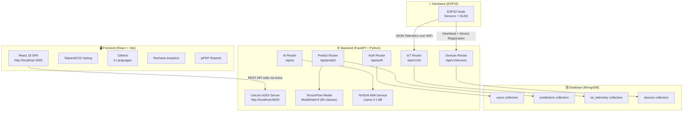
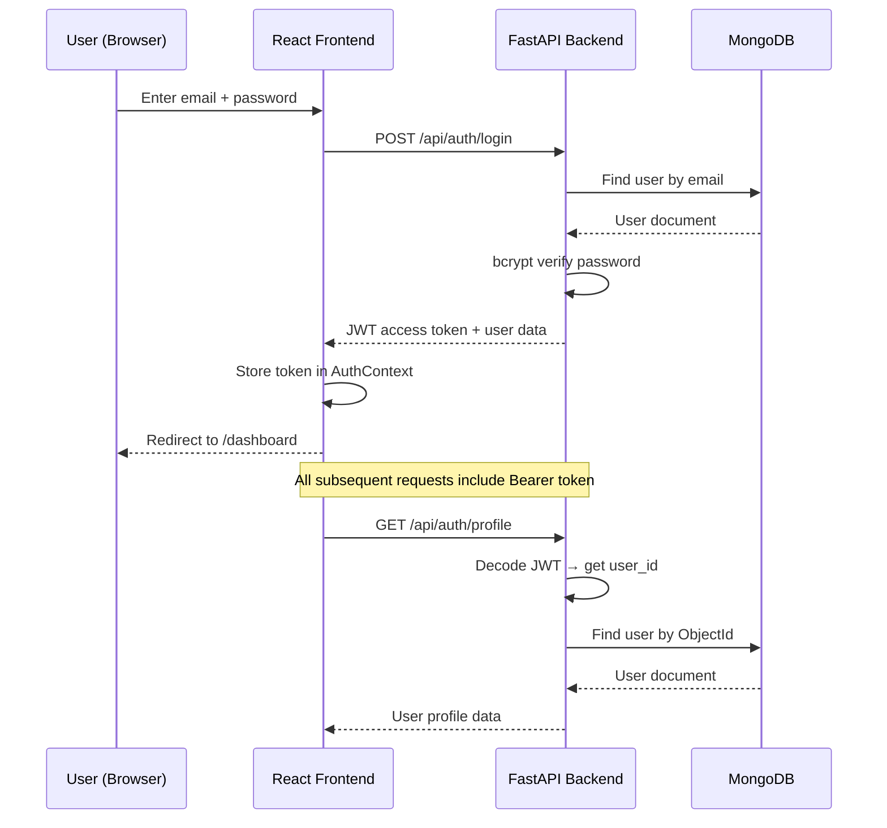
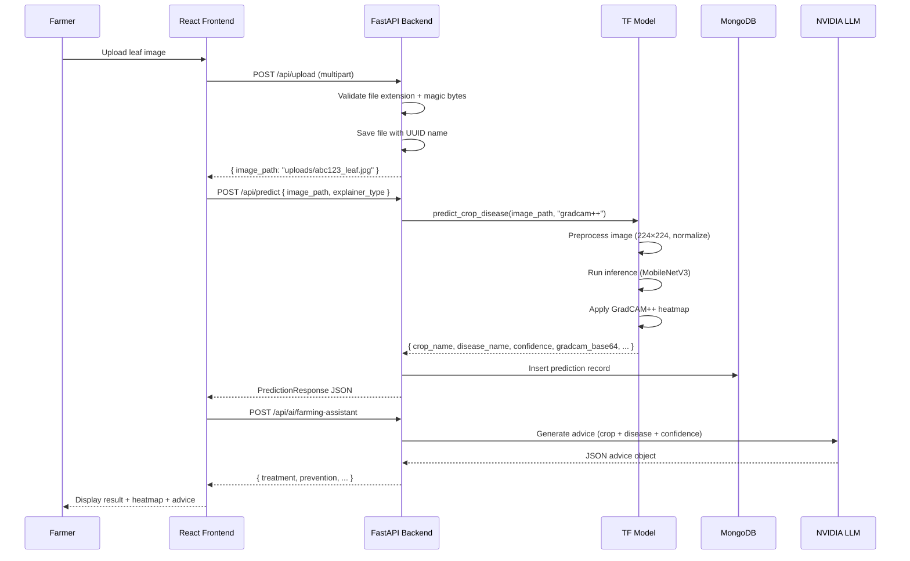
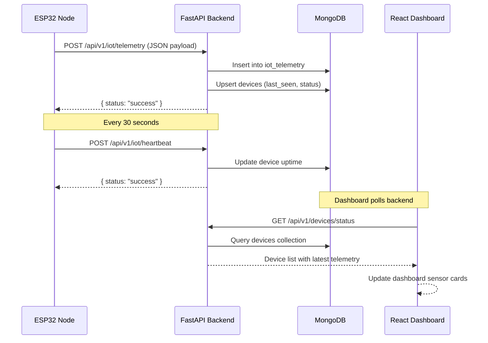

# 🏗️ Software Architecture – Agri Shield

## Overview

The Agri Shield software stack is a **3-tier local web application** consisting of:
1. **Frontend** – React 18 SPA (Single Page Application) running on Vite dev server
2. **Backend** – FastAPI REST API running with Uvicorn
3. **Database** – MongoDB (local instance)

The AI components (disease detection model and chatbot LLM) are integrated directly into the backend as Python services.

---

## Overall Software Stack Diagram



---

## Communication Protocols

| Connection | Protocol | Format | Port |
|------------|----------|--------|------|
| Browser → Backend | HTTP/REST | JSON | 8000 |
| ESP32 → Backend | HTTP/REST | JSON | 8000 |
| Backend → MongoDB | Motor (async) | BSON | 27017 |
| Backend → NVIDIA API | HTTPS | JSON/OpenAI | 443 |
| Frontend Dev Server | HTTP | HTML/JS/CSS | 3000 |

---

## Authentication Flow



---

## Image Upload + Disease Prediction Flow



---

## IoT Telemetry Flow



---

## Local Deployment Architecture

All services run on a **single machine** on the local network:

```
┌──────────────────────────────────────────────────────┐
│                  LOCAL MACHINE                       │
│                                                      │
│  ┌────────────────┐   ┌─────────────────────────┐   │
│  │ React Frontend │   │   FastAPI Backend        │   │
│  │ localhost:3000 │──►│   localhost:8000         │   │
│  │ npm run dev    │   │   python -m uvicorn      │   │
│  └────────────────┘   └────────────┬────────────┘   │
│                                    │                 │
│                        ┌───────────▼───────────┐    │
│                        │  MongoDB (local)       │    │
│                        │  localhost:27017       │    │
│                        │  mongod service        │    │
│                        └───────────────────────┘    │
│                                                      │
│  PYTHONPATH = c:\AI Crop Disease Detection System    │
└──────────────────────────────────────────────────────┘
          │
          │ WiFi (same LAN)
          │
┌─────────▼──────────────┐
│  ESP32 Hardware Node   │
│  Backend URL: http://  │
│  192.168.x.x:8000      │
└────────────────────────┘
```

---

## Environment Variables

### Backend `.env`

| Variable | Example Value | Description |
|----------|--------------|-------------|
| `HOST` | `127.0.0.1` | Backend bind host |
| `PORT` | `8000` | Backend bind port |
| `DEBUG` | `True` | Debug mode |
| `JWT_SECRET_KEY` | `<32-char random>` | JWT signing key |
| `JWT_ALGORITHM` | `HS256` | JWT algorithm |
| `ACCESS_TOKEN_EXPIRE_MINUTES` | `1440` | 24-hour token expiry |
| `MONGODB_URI` | `mongodb://localhost:27017/crop_disease_db` | MongoDB connection string |
| `DATABASE_NAME` | `crop_disease_db` | DB name |
| `NVIDIA_API_KEY` | `nvapi-xxxxx` | NVIDIA NIM API key |
| `NVIDIA_API_BASE_URL` | `https://integrate.api.nvidia.com/v1` | NVIDIA API endpoint |
| `NVIDIA_MODEL_NAME` | `meta/llama-3.1-8b-instruct` | LLM model name |

---

## Technology Stack Summary

### Backend
| Technology | Version | Role |
|-----------|---------|------|
| Python | 3.11+ | Language |
| FastAPI | 0.100+ | REST API framework |
| Uvicorn | 0.22+ | ASGI server |
| Motor | 3.2+ | Async MongoDB driver |
| TensorFlow CPU | 2.12+ | ML inference |
| OpenCV | 4.8+ | Image preprocessing + GradCAM |
| Pillow | 9.5+ | Image file handling |
| NumPy | 1.23+ | Array operations |
| passlib[bcrypt] | 1.7+ | Password hashing |
| python-jose | 3.3+ | JWT token operations |
| openai | 1.0+ | NVIDIA NIM API client |
| pydantic | 2.0+ | Schema validation |

### Frontend
| Technology | Version | Role |
|-----------|---------|------|
| React | 18.2 | UI framework |
| Vite | 4.4 | Build tool + dev server |
| TailwindCSS | 3.3 | Utility-first CSS |
| React Router | 6.14 | Client-side routing |
| Axios | 1.4 | HTTP client |
| i18next | 26+ | Internationalization |
| Recharts | 3.9 | Analytics charts |
| Framer Motion | 12+ | Animations |
| jsPDF | 4.2 | PDF report generation |
| Lucide React | 0.263 | Icon library |
| QRCode React | 4.2 | Device QR codes |
