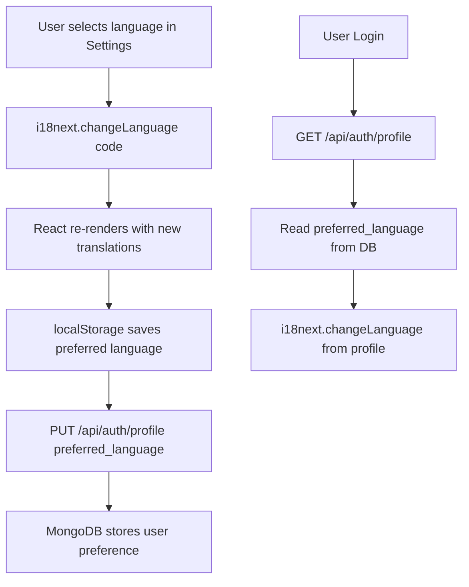

# 🌐 Translation System – Agri Shield i18n

## Overview

Agri Shield supports **6 Indian and international languages** through a fully integrated internationalization (i18n) system built with **i18next** and **react-i18next**. The language selection is tied to the user profile and persists across sessions.

---

## Supported Languages

| Code | Language | Region |
|------|----------|--------|
| `en` | English | Global (default) |
| `hi` | Hindi (हिंदी) | North India |
| `te` | Telugu (తెలుగు) | Andhra Pradesh, Telangana |
| `ta` | Tamil (தமிழ்) | Tamil Nadu, Sri Lanka |
| `kn` | Kannada (ಕನ್ನಡ) | Karnataka |
| `ml` | Malayalam (മലയാളം) | Kerala |

---

## Technical Architecture



---

## i18next Configuration

**File:** `frontend/src/i18n/config.js`

```javascript
import i18n from 'i18next';
import { initReactI18next } from 'react-i18next';
import LanguageDetector from 'i18next-browser-languagedetector';
import { resources } from './translations';

i18n
  .use(LanguageDetector)
  .use(initReactI18next)
  .init({
    resources,
    fallbackLng: 'en',
    interpolation: { escapeValue: false },
    detection: {
      order: ['localStorage', 'navigator'],
      caches: ['localStorage']
    }
  });
```

---

## Translation File Structure

**File:** `frontend/src/i18n/translations.js`

The translations are organized by **namespace categories**:

```javascript
export const resources = {
  en: {
    translation: {
      nav: { dashboard, analytics, devices, scan_crop, ... },
      dashboard: { title, subtitle, scan_button, health_score, ... },
      metrics: { temperature, humidity, soil_moisture, light, rain, ... },
      common: { healthy, diseased, save, cancel, delete, search, ... }
    }
  },
  hi: { translation: { nav: {...}, dashboard: {...}, ... } },
  te: { translation: { nav: {...}, dashboard: {...}, ... } },
  ta: { translation: { nav: {...}, dashboard: {...}, ... } },
  kn: { translation: { nav: {...}, dashboard: {...}, ... } },
  ml: { translation: { nav: {...}, dashboard: {...}, ... } }
}
```

---

## Translation Categories

| Category | Key | Example (English) | Example (Telugu) |
|----------|-----|-------------------|-----------------|
| Navigation | `nav.dashboard` | Dashboard | డాష్‌బోర్డ్ |
| Navigation | `nav.scan_crop` | Scan Crop | పంట స్కాన్ |
| Dashboard | `dashboard.title` | Smart Farm Overview | స్మార్ట్ ఫామ్ అవలోకనం |
| Dashboard | `dashboard.scan_button` | AI Disease Scan | AI వ్యాధి స్కాన్ |
| Metrics | `metrics.temperature` | Temperature | ఉష్ణోగ్రత |
| Metrics | `metrics.soil_moisture` | Soil Moisture | నేల తేమ |
| Common | `common.healthy` | Healthy | ఆరోగ్యంగా |
| Common | `common.diseased` | Diseased | వ్యాధిగ్రస్తం |

---

## Using Translations in React Components

```jsx
import { useTranslation } from 'react-i18next';

function DashboardPage() {
  const { t } = useTranslation();
  
  return (
    <div>
      <h1>{t('dashboard.title')}</h1>
      <p>{t('dashboard.subtitle')}</p>
      <button>{t('dashboard.scan_button')}</button>
    </div>
  );
}
```

---

## Translation Workflow

```mermaid
sequenceDiagram
    participant U as User
    participant S as SettingsPage
    participant I as i18next
    participant A as AuthContext
    participant API as FastAPI

    U->>S: Select language from dropdown
    S->>I: i18n.changeLanguage('te')
    I->>I: Load Telugu translations
    I-->>S: React components re-render
    S->>API: PUT /api/auth/profile { preferred_language: 'te' }
    API-->>S: Updated user profile
    S->>A: Update AuthContext user
    
    Note: All text in app is now in Telugu
```

---

## Language Persistence

1. **localStorage** – i18next detector saves `i18nextLng` key
2. **User Profile** – Backend stores `preferred_language` in MongoDB
3. **Session Restore** – On login, profile's `preferred_language` is passed to `i18n.changeLanguage()`

---

## Adding a New Language

To add a new language (e.g., Marathi – `mr`):

1. Open `frontend/src/i18n/translations.js`
2. Add a new language block:
   ```javascript
   mr: {
     translation: {
       nav: {
         dashboard: "डॅशबोर्ड",
         scan_crop: "पीक स्कॅन",
         ...
       },
       ...
     }
   }
   ```
3. Add `mr` to the language selector in `SettingsPage.jsx`
4. Add `mr` as a supported option in the user registration form

---

## AI Chatbot Language Consideration

The AI chatbot (NVIDIA NIM) responds in **English by default**. The `preferred_language` from the user profile is passed to the chatbot context, and the LLM prompt instructs it to respond in the farmer's preferred language when possible:

```
System prompt addition:
"The farmer's preferred language is Telugu (te). 
Respond in simple Telugu if the user writes in Telugu, 
otherwise respond in simple English."
```

> [!NOTE]
> Full multilingual LLM response quality depends on the Llama 3.1 8B model's training data for each language. English responses are most reliable.

---

## Translation Coverage Status

| Language | Nav | Dashboard | Metrics | Common | AI Labels |
|----------|-----|-----------|---------|--------|-----------|
| English (en) | ✅ | ✅ | ✅ | ✅ | ✅ |
| Hindi (hi) | ✅ | ✅ | ✅ | ✅ | 🔄 Partial |
| Telugu (te) | ✅ | ✅ | ✅ | ✅ | 🔄 Partial |
| Tamil (ta) | ✅ | ✅ | ✅ | ✅ | 🔄 Partial |
| Kannada (kn) | ✅ | ✅ | ✅ | ✅ | 🔄 Partial |
| Malayalam (ml) | ✅ | ✅ | ✅ | ✅ | 🔄 Partial |
