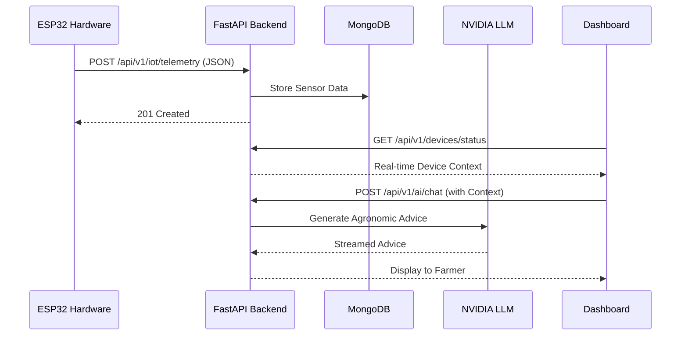

# IoT Communication Flow

```mermaid
sequenceDiagram
    participant ESP32 as ESP32 Hardware
    participant API as FastAPI Backend
    participant DB as MongoDB
    participant LLM as NVIDIA LLM
    participant UI as Dashboard

    ESP32->>API: POST /api/v1/iot/telemetry (JSON)
    API->>DB: Store Sensor Data
    API-->>ESP32: 201 Created
    UI->>API: GET /api/v1/devices/status
    API-->>UI: Real-time Device Context
    UI->>API: POST /api/v1/ai/chat (with Context)
    API->>LLM: Generate Agronomic Advice
    LLM-->>API: Streamed Advice
    API-->>UI: Display to Farmer
```
